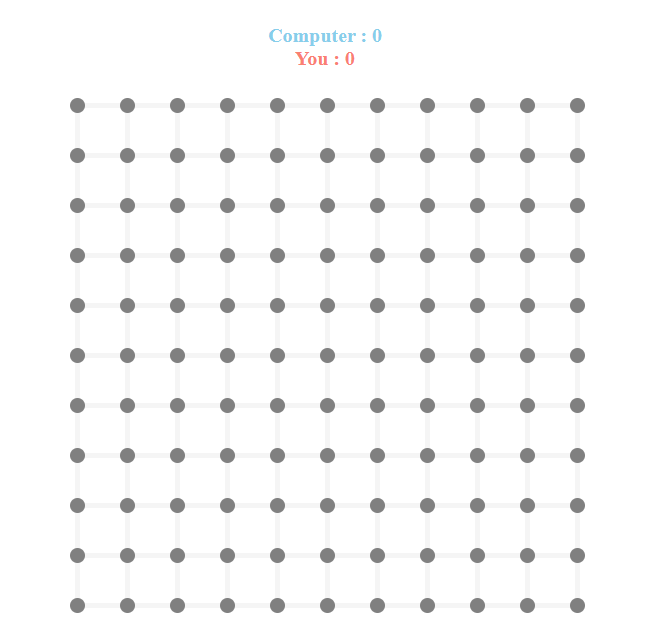

## Welcome to Dot and Boxes Game

## **Description 📃**

Dot and Boxes is an exciting game built with HTML, CSS, and JavaScript, offering players an immersive gaming experience. This README provides an overview of the game and instructions on how to play.

## **Functionalities 🎮** 

- **Engaging Gameplay**: Enjoy hours of fun with addictive gameplay mechanics.
- **Sleek Design**: Experience a visually stunning game interface designed with CSS.
- **Interactive Elements**: Dive into interactive elements crafted with JavaScript for dynamic gaming experiences.

## **How to play? 🕹️**

1. **Click alternaltely for each player's chance**: By clicking alternately on the screen, it allows 2 players to play at the same time.
5. **Who is the winner**: The one who creates most boxes by connecting the dots. 

## **Screenshots 📸**

<!--  -->
**How it appears:**

**How it appears while playing:**

<!--  -->

### Tech Stack:

- Built with HTML, CSS, and JavaScript

### Feedback and Support:

We appreciate any feedback or suggestions you have to improve the game. Feel free to open an issue on GitHub.

Enjoy playing Dot and Boxes! 🎮
