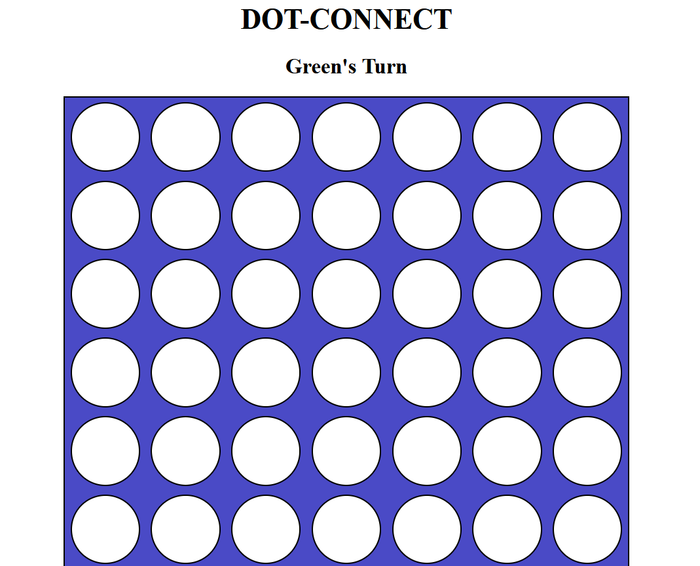
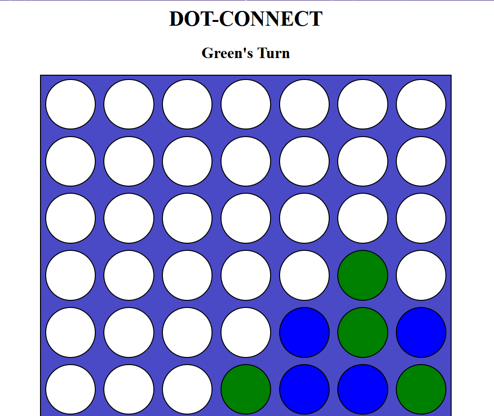
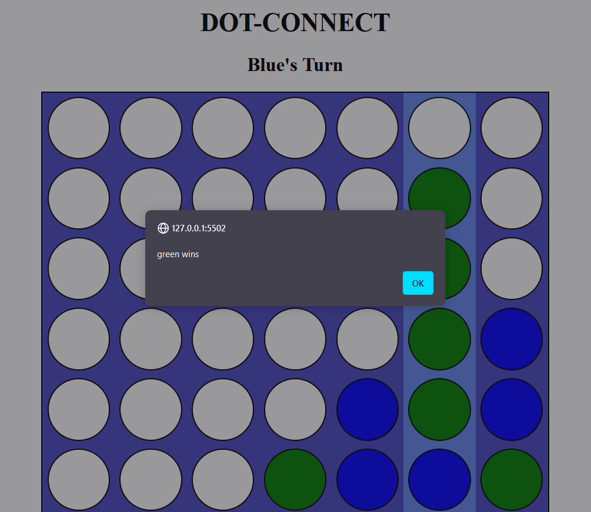

## Welcome to DotConnect

## **Description 📃**

DotConnect is an exciting game built with HTML, CSS, and JavaScript, offering players an immersive gaming experience. This README provides an overview of the game and instructions on how to play.

## **Functionalities 🎮** 

- **Engaging Gameplay**: Enjoy hours of fun with addictive gameplay mechanics.
- **Sleek Design**: Experience a visually stunning game interface designed with CSS.
- **Interactive Elements**: Dive into interactive elements crafted with JavaScript for dynamic gaming experiences.

## **How to play? 🕹️**

1. **Installation**: Clone this repository to your local machine.
2. **Run the Game**: Open the `index.html` file in your preferred web browser.
3. **Game Instructions**: Follow the on-screen prompts to learn how to play.
4. **Click alternaltely for each player's chance**: By clicking alternately on the screen, it allows 2 players to play at the same time.
5. **Who is the winner**: The one who creates a 4 dot row, it can be top, bottom, left or right.

## **Screenshots 📸**

<!--  -->
**How it appears:**

**How it appears while playing:**

<!--  -->

**How it appears on winning:**

### Tech Stack:

- Built with HTML, CSS, and JavaScript

### Feedback and Support:

We appreciate any feedback or suggestions you have to improve the game. Feel free to open an issue on GitHub.

Enjoy playing DotConnect! 🎮
