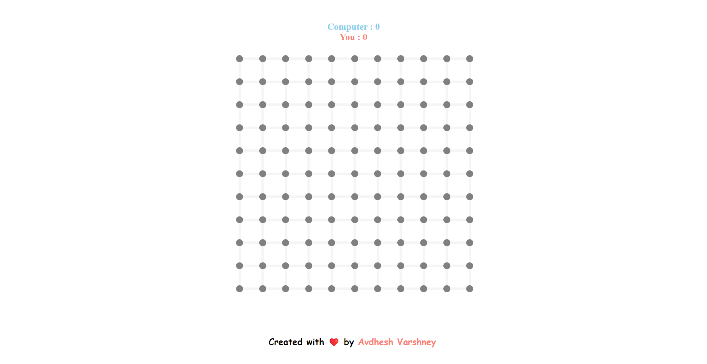

# **DOTS AND BOXES GAME** 

---

 

## **Description 📃** 
- This project is built on a basic web tech stacks such as HTML, CSS, jquery and Javascript.
- This is a single-player game.
- Adding AI functionality makes it more impressive.

## **functionalities 🎮** 
- The player has required to create more boxes to win.
- When one player has make a full box, he/she will get a bonus chance to play again.
- More the boxes, more will your score and you will be winner of the game.

## ** Additional Features **
- Displaying the current score of the players.
- Implementing a graphical user interface (GUI) for a more interactive experience.
- Adding a background music so that user will not bored from the game as this game is for minded person.

 

## **Screenshots 📸**

 

 

## **Working video 📹**
<!-- add your working video over here -->
https://github.com/kunjgit/GameZone/assets/114330097/3e414d2e-b799-4bb2-b97a-8a5668a08f71

