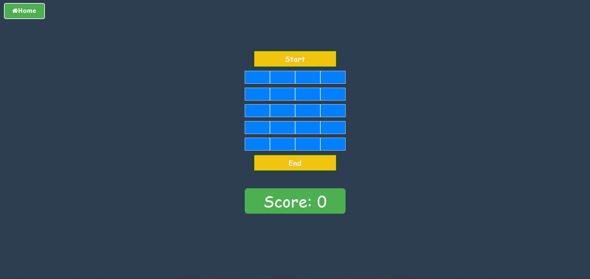

# Dragon Tower Game 🐉🏰

## Description 📃
Dragon Tower is an engaging and strategic game where players navigate through a tower filled with hidden treasures and traps. The objective is to reach the top of the tower while collecting as many eggs as possible and avoiding deadly mines. Each decision can lead to a valuable reward or a sudden game over, making every move crucial.

## Features 🎮
- **Dynamic Gameplay:**
  - Randomized positions of eggs and mines in each game ensure a unique experience every time.
- **Interactive Interface:**
  - Intuitive UI with horizontal rows and three columns.
  - Visually appealing design with animations and beautiful backgrounds.
- **Hidden Items Mechanic:**
  - Items are initially hidden and revealed only when a tile is selected, adding suspense and strategy.
- **Scoring System and Alerts:**
  - Points are awarded for collecting eggs, and a 'Game Over' alert appears when a mine is selected.
- **Replayability and Restart:**
  - Easy restart feature for quick game replays and high replay value due to randomized elements.
- **Mobile Compatibility:**
  - Optimized for both desktop and mobile devices with a responsive design for smooth gameplay.

## How to Play? 🕹️
1. Open the game in your web browser.
2. Begin at the bottom row of the tower.
3. Select a tile in one of the three columns to reveal its content.
4. If the tile contains an egg, you gain points and proceed to the next row.
5. If the tile contains a mine, the game ends with a 'Game Over' alert, and you must restart.
6. Continue selecting tiles, aiming to reach the top of the tower with the highest score possible.

## Screenshots 📸

