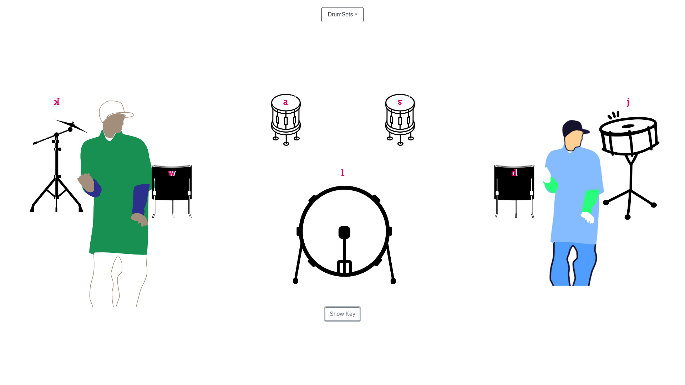
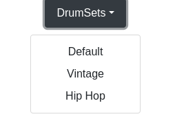

# **Drum_Kit** 

---

 

## **Description 📃**
- Drum Kit Simple Game is an interactive and entertaining virtual experience that brings the joy of playing drums right to your fingertips. Designed with simplicity and fun in mind, this game offers a user-friendly interface and captivating gameplay that will have you drumming to your heart's content.

## **functionalities 🎮**
- As you launch the game, you are greeted with a vibrant and visually appealing interface, reminiscent of a real drum set. The layout is intuitive, featuring a collection of drums and cymbals arranged in a manner that mimics a traditional drum kit. Each drum element is clearly labeled, making it easy for players of all skill levels to understand and engage with the game.
 

## **How to play? 🕹️**
- To play, you simply use your computer keyboard, touchscreen, or compatible input device to strike the virtual drums. The game responds with highly realistic and dynamic sound effects, simulating the distinct sounds produced by each drum and cymbal. Whether it's the deep thud of the bass drum or the crisp crash of a cymbal, the game delivers an authentic drumming experience.

 

## **Screenshots 📸**

 

- Toggle Keys
  

- Different Drum Sets

 

## **Working video 📹**
<!-- add your working video over here -->
