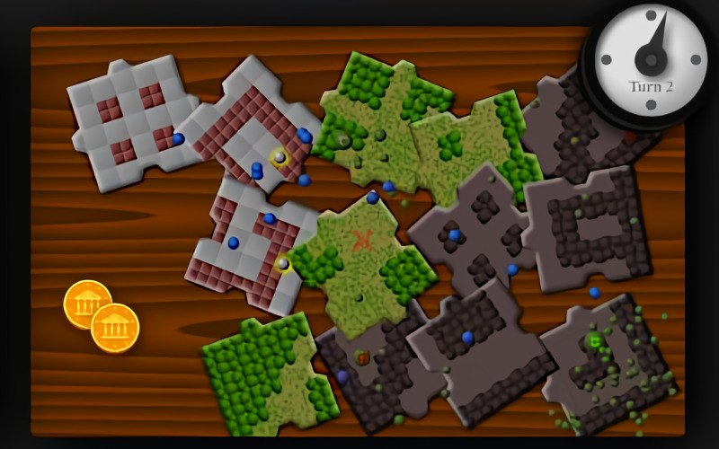

# **Dungeon_Puzzle** 

---

 

## **Description 📃**
- You must to mount a puzzle to connect lands and build a path where your heroes will walk and fight the undead, until find and kill the Lord of Death.

## **How to play? 🕹️**
- When you place a piece, you earn gold and more warriors on each neighbor piece with the same terrain. If no available piece matches the place you want, you can pay to randomly replace one.

- When your heroes find an undead, they will fight, unless you change they behavior to "craven". When attacked, an entity will bleed, so you can see how near to dead is that unity. When you kill an undead, you earn gold.

- All entities are stupid boids. They don't understand walls, they don't calculate paths. You can't control your heroes directly. The better you can do is to click on the map point where they will be attracted, and change their behavior.
	
 

## **Screenshots 📸**

 

 
