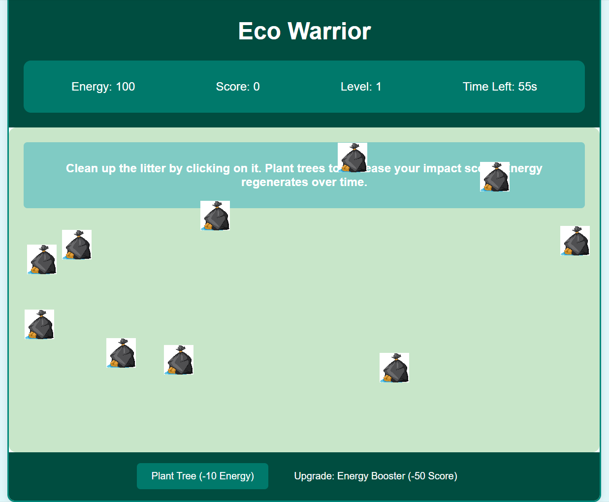

# Eco Warrior

## Overview

Eco Warrior is an educational and engaging game designed to raise awareness about environmental conservation. Players take on the role of an eco-warrior whose mission is to clean up litter, plant trees, and restore ecosystems. The game is designed to be both fun and educational, teaching players the importance of keeping the environment clean and green.

## How to Play

- **Objective**: Clean up all the litter within the given time to advance to the next level. Additionally, plant trees to increase your impact score and improve the environment.
- **Energy**: Start with 100 energy points. Cleaning litter and planting trees consume energy. Energy regenerates over time.
- **Score**: Earn points by cleaning litter and planting trees. Higher scores unlock upgrades and allow you to progress to higher levels.
- **Timer**: Each level has a countdown timer. Clean up all the litter before the time runs out to complete the level. The time available increases with each subsequent level.

## Game Elements

- **Litter**: Click on litter items scattered around the game area to clean them up. Each piece of litter cleaned increases your score.
- **Trees**: Plant trees to improve your score and the environment. Planting a tree costs 10 energy points.
- **Upgrades**: Accumulate 50 points to purchase an upgrade that increases your energy regeneration rate.

## Levels

The game consists of multiple levels, each progressively more challenging:
- **Level 1**: Start with 10 pieces of litter and 60 seconds to clean them up.
- **Subsequent Levels**: Each new level adds 5 more pieces of litter and increases the timer by 10 seconds. The challenge increases as you progress, requiring more strategic use of energy and time.

## Game Over

If you fail to clean up all the litter within the given time, the game will display a "Game Over" message and reset. Try again to beat your previous scores and advance further.

## Screenshots

## Try It Out

You can try out the game by opening the `index.html` file in your web browser.

## Educational Impact

Eco Warrior aims to educate players about the importance of environmental conservation. By simulating the cleanup process and tree planting, players learn the value of these actions in a fun and interactive way. The game encourages players to think about real-world environmental issues and how they can contribute to a cleaner, greener planet.

## Gameplay Tips

- **Manage Energy**: Keep an eye on your energy levels. Avoid running out of energy by allowing time for regeneration.
- **Strategize**: Plan your moves to efficiently clean up litter and plant trees without wasting energy.
- **Upgrade Wisely**: Use your score to purchase upgrades that will help you in higher levels by increasing your energy regeneration rate.

## Credits

Eco Warrior was created to raise awareness about environmental conservation. Thank you for playing and contributing to a cleaner, greener planet.
