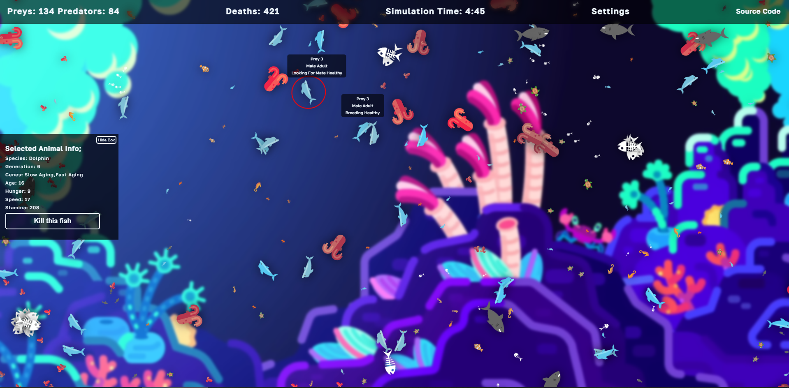

# Ocean Ecosystem

I am trying to create an ecosystem on web. Mostly inspired by Sebastian Lague's Unity version and other real life variants.

### How Does It Work?

Different animal species have varying power levels; if something surpasses your power level, it's best to flee. For example, a shark has a power level of 4, while a piranha only has 2. These creatures hunt for survival, breed if conditions are favorable, and eventually pass away when they reach maturity.

### Community

In this little world of mine, there are various species of animals. Check out the list of creatures that inhabit this ecosystem.

|    Name     |   Type   |  Size  | Power Level |
| :---------: | :------: | :----: | :---------: |
|    Shark    | Predator | Large  |      4      |
|   Turtle    |   Prey   | Small  |      2      |
|   Dolphin   |   Prey   | Medium |      3      |
| Clown Fish  |   Prey   | Small  |      2      |
|   Piranha   | Predator | Small  |      2      |
| Ballon Fish |   Prey   | Small  |      2      |
| Angler Fish | Predator | Medium |      3      |
|  Goldfish   |   Prey   | Small  |      2      |
|   Shrimp    |   Prey   |  Tiny  |      0      |
|   Octopus   | Predator | Medium |      3      |
|  Seahorse   |   Prey   | Small  |      2      |

### Gene Pools

I've made 2 gene pools for animals to choose from: one with good genes and the other with bad.

|   Good Genes    |         Bad Genes         |
| :-------------: | :-----------------------: |
|     Healthy     |    Sick (Lesser speed)    |
| Slow Metabolism |      Fast Metabolism      |
|   Slow Aging    |        Fast Aging         |
|   Good Vision   | Bad Vision (Lesser range) |
|      Agile      |  Bulky (Gets tired fast)  |

Animals inherit one gene from each pool at first, which can be good or bad. Natural selection decides which animals survive and reproduce based on their genes. Those with better genes have a greater chance of thriving and passing on their genes, while those with less advantageous genes may struggle and have fewer offspring.

### Breeding

When animals have fulfilled their basic needs and are not threatened by others, they start searching for a mate. Once they have found a suitable partner, they will mate, and the female will carry their offspring for around 18 seconds or longer, the duration being random. And will produce 5 to 10 babies to the world. Each animal has only one opportunity to breed, after which they will not mate again. Offspring inherit genes from their parents, which can lead to extinction or improvement of the species.

### Videos that Inspire Me

- [Simulating an Ecosystem](https://youtu.be/r_It_X7v-1E) - Sebastian Lague's Unity ecosystem.
- [One Year Ago I Built an Ecosystem, This Happened](https://youtu.be/QTH9m6MDIfc) - Dr. Plants' real-life ecosystem.

## License

MIT License.

Check out [LICENSE](./LICENSE) for more detail.
