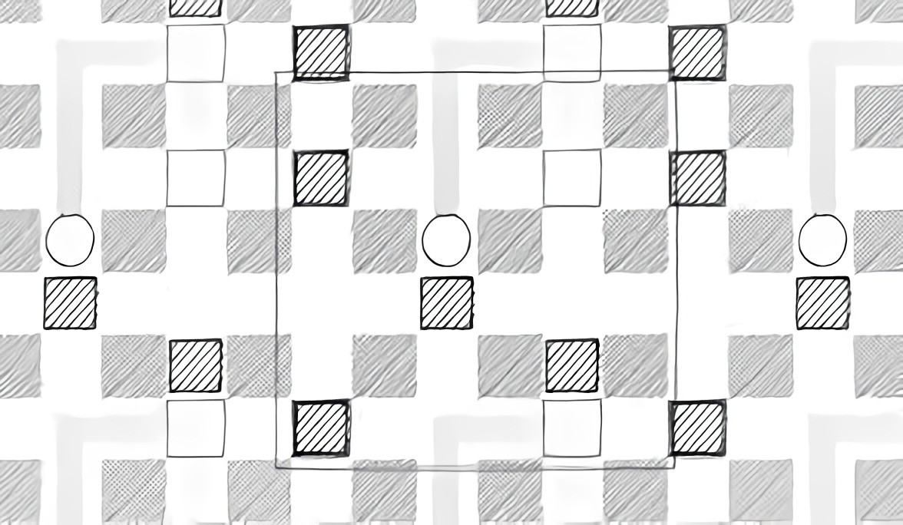

# **Edge_Not_Found** 

---

 

## **Description 📃**
- Edge Not Found is a Sokoban-style puzzle game set on an infinitely repeating grid. 
- There are 20+ puzzles and they get can get pretty tricky.

## **How to play? 🕹️**
- Controls:
	- Move - W, A, S, D
	- Restart - R
	- Pause - P
	
 

## **Screenshots 📸**

 

 
