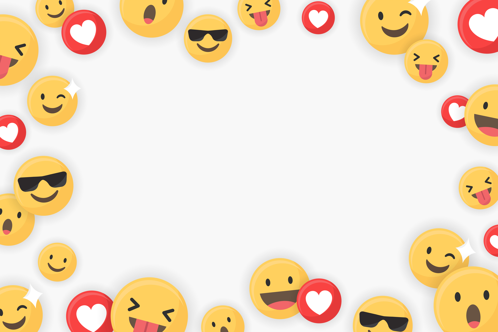

# **Emoji_Charades** 

---

 

## **Description 📃**
- The Emoji Charades game is a classic game where the player has to guess the words what the emoji's are describing. It requires high relatable knowledge with the real world.It is built using HTML,CSS and JS. 

## **functionalities 🎮**
- The game starts with emoji's displaying on the screen and an input box for the player to guess the correct description of the emoji's displayed. If the user guesses it correctly then their score increases. The game includes features such as score counter, submit button and cool sound effects.
 

## **How to play? 🕹️**
- The game will automatically start as the player chooses the game.
- The game will display random emoji's on the screen. 
- The player needs to guess the correct description of the emoji's shown to increase their score.
- If the player guesses correctly then his score increases and there will be a win sound generated.
- Otherwise there will be a wrong buzzer generated and the game will ask the player to try again. 

 

## **Screenshots 📸**

 

;

 

## **Working video 📹**
<!-- add your working video over here -->
