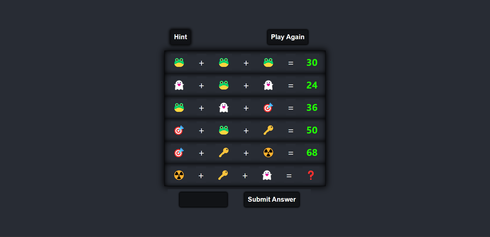

# **Emoji Puzzle Game**

---

 

## **Description 📃** 
- This project is built on a basic web tech stacks such as HTML, CSS and Javascript.
- This game is for fun and build the math skills of kids.

## **functionalities 🎮** 
- This game is having 6 equations
- Out of 5 equations, 1 equation has done not have their equivalent answer
- So, just solve the above 5 equations to obtain the answer of the last equation
- Once solved, submit the answer
- If wrong, check the hint which provide the answer of the equation

## ** Additional Features **
- Providing a New Game button will provide different equations as random function is used.
- Hint button will provide the answer of the last equation.
- If answer is completed, a grand congratulation sound is added.
- If wrong, a failure sound is also added.

 

## **How to play? 🕹️**
- Just solve the equations
- Obtain the values of different emojis
- And finally get the answer of the last equation
- Submit the answer and enjoy the grand congrats.

 

## **Screenshots 📸**

 

 

## **Working video 📹**
<!-- add your working video over here -->
https://github.com/kunjgit/GameZone/assets/114330097/06b9cff5-7fa6-44d8-8830-7e214df421c7
