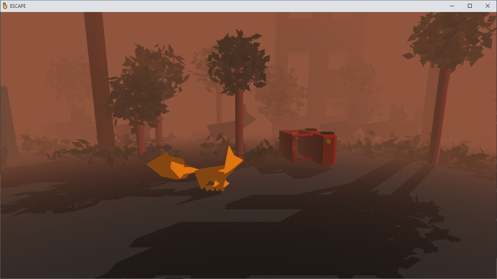

# **Escape** 

---

 

## **Description 📃**
- This game is a 2.5D puzzle platformer about wildlife that we leave behind. 
- We want to find our cubs and reach the Ark to save ourself!
- The story is set during the evacuation of Earth.
- Mankind has abandoned Earth after it could no longer support life.
- Solve environmental puzzles in a dynamic world taken over by nature.

## **Functionalities 🎮**
- 3 maps with environmental puzzles of increasing difficulty.
- Skeletal animations of all animals, and a procedurally animated tail of the fox.
- Dynamic environment: real-time shadows, procedural sound track, rigid body physics.
- Dynamically adjusted quality settings for low-spec devices.

## **How to play? 🕹️**
- Desktop: 
	- ARROWS to move, SPACE to grab objects.
- Mobile: 
	- HOLD to move, DOUBLE-TAP to grab objects.
	
 

## **Screenshots 📸**

 

 

## **Working video 📹**

https://github.com/kunjgit/GameZone/assets/92252895/8b05e622-8dfc-4140-9d39-303cd5e5b3c0
