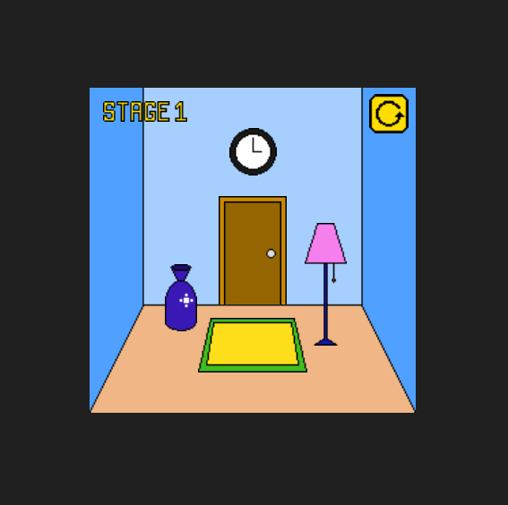

## Description
This is an excape room game where you have to find the clues and escape through the game.

## Functionalities
Some key functionalities of the Escape Room Game:

- Level progression: The game consists of 10 levels of increasing difficulty. Each level presents unique challenges and puzzles that need to be solved to advance to the next level.

- Clue discovery: Players must thoroughly search each room to find hidden clues. Clues can be found in various forms such as objects, symbols, numbers, or even through interactions with the environment.

## How to play?

-Search the room thoroughly for hidden clues. They can be concealed within furniture, paintings, books, or even beneath objects. Remember, nothing is as it seems!
-Use your keen observation skills to connect the dots. Analyze the clues you've found and look for patterns, associations, or relationships between them. Sometimes, the most insignificant detail can hold the key to your escape.

## Screenshots

