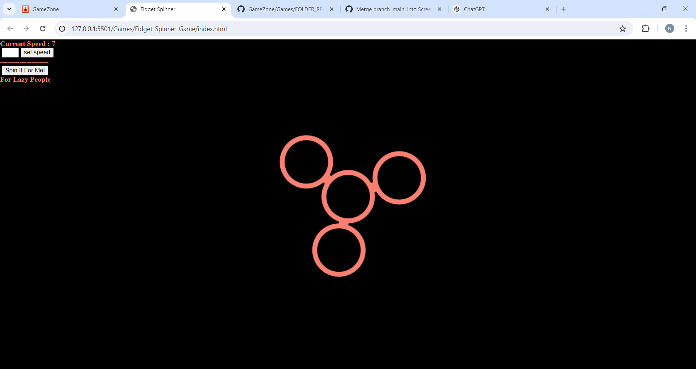

# Fidget Spinner

A fidget spinner made in JavaScript.

## Description 📃

 Fidget Spinner is an interactive online simulation of a physical fidget spinner. This digital version allows users to experience the satisfying and stress-relieving sensation of spinning a fidget spinner directly from their browser.

## Functionalities 🎮

- **Interactive Spinning**: Users can spin the fidget spinner by dragging the mouse across the screen.
- **Speed Display**: The current speed of the spinner is displayed, giving users real-time feedback.
- **Custom Speed Setting**: Users can set a custom speed for the fidget spinner, allowing for a personalized experience.
- **Automatic Spin**: For those who prefer not to drag their mouse, a button is available to automatically spin the fidget spinner.

## How to Play? 🕹️

1. **Drag to Spin**: Click and drag the mouse across the spinner to make it spin. The faster you drag, the faster the spinner will rotate.
2. **View Speed**: Watch the speedometer to see how fast the spinner is going.
3. **Set Custom Speed**: Use the input box to set a custom speed for the spinner.
4. **Automatic Spin**: Click the "Spin" button to make the spinner spin without dragging.

## Screenshots 📸

## Updates

- **Speed Display**: Added for real-time feedback.
- **Custom Speed Setting**: Introduced a feature to set custom speed.
- **Automatic Spin**: Added a "Spin" button for automatic spinning.

Enjoy the virtual spinning experience and have fun!
