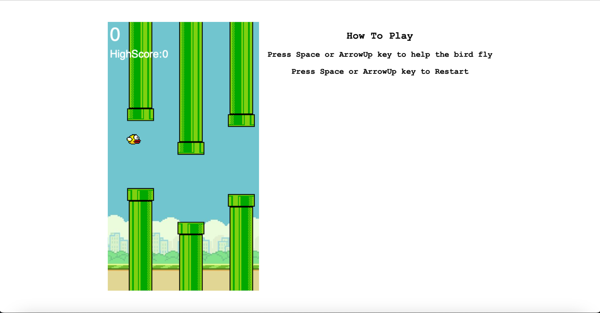

**Simon_Game_Challenge** 

 This is a simple implementation of the Flappy Bird game using HTML, CSS, and JavaScript.

  

 ## **Description 📃**
 - Flappy Bird is a popular side-scrolling game where the player controls a bird and tries to navigate it through gaps between pipes without touching them. The objective is to achieve the highest possible score by successfully passing through as many gaps as possible.

 ## **functionalities 🎮**
 - The game starts as soon as it is loaded in the browser.
 - The player can control the bird's movement by clicking or tapping on the screen, causing the bird to flap its wings and ascend.
 - Gravity pulls the bird downward, and if it touches any of the pipes or the ground, the game is over.
 - The player's score increases with each successfully passed gap between the pipes.
 - The game keeps track of the player's highest score.
 - The player can restart the game by refreshing the page.
  

 ## **How to play? 🕹️**
 - To play or keep the bird Floating Press Space or Arrow Up key
 - The game will stopp once the birds collides or Falls
 - Press space or arrowup key to then restart the game

  

 ## **Screenshots 📸**

  

 

  

 ## **Working video 📹**

  

https://github.com/AbhishekPSingh07/GameZone/assets/79076050/7e790f27-2092-4810-8612-d31fe38609ab

    
  
