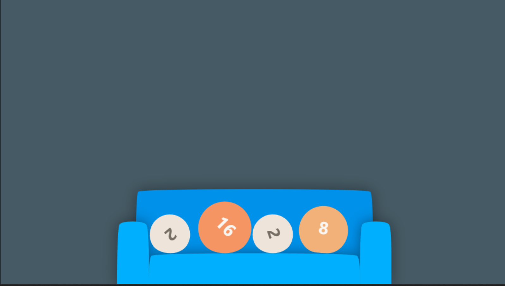
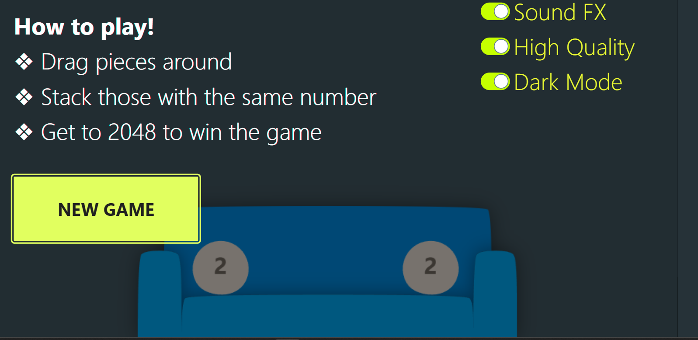

# Flappy-bubble-sofa

An animated and fun version of the popular fibannaco 2048 game. Built with HTML, CSS and Javascript.

## How to play 

Move the bubbles with your mouse and add up the same numbers. After adding up two bubbles, two more drop and will not return if they fall over the sofa. 

You can turn off the music and sound effects from the home page and also choose the quality of game.

# Tech stack
HTML , Css, Javascript

## Play here:- https://64cdf4cd2039341b0ca4a62e--inquisitive-starlight-4c9f15.netlify.app/

Demo Screenshot:-

