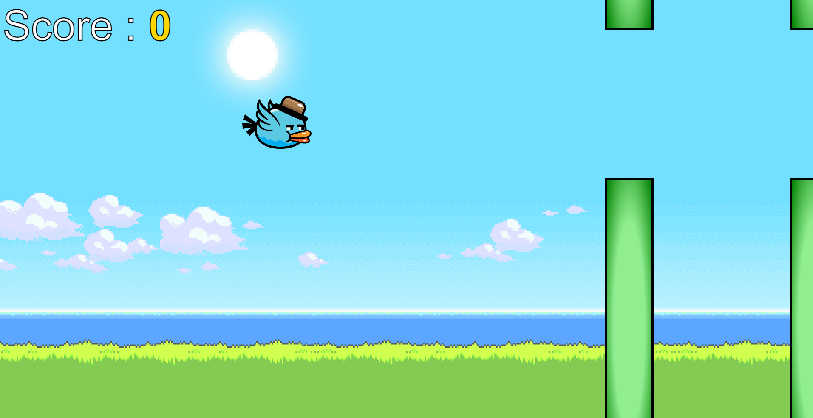

# _Game_Name_

---

Flappy_bird

 

## _Description 📃_

The HTML and CSS are used to structure and style the game interface, while JavaScript handles the game's logic and interactivity. JavaScript provides the necessary functionality to detect player input, control the bird's movement, calculate collisions, and update the game's state in real-time.

## _functionalities 🎮_
- fully responsive design
- animated view
- background sound

 

## _How to play? 🕹️_

-Enter key - to start the game.
-up arrow key - tap this key to fly the bird and dodge the obstacles .

 

## _Screenshots 📸_

 

 
