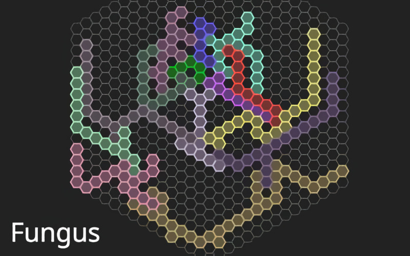

# **Fungus** 

---

 

## **Description 📃**
- Fungi decompose the dead. In this game, it is the player's objective to decompose the dead creatures. 
- They are composed of molecules that can be dragged and rotated. 

## **How to play? 🕹️**
- When all molecules are dropped off the grid the level is completed. 
- Molecules are moved by drag and drop and rotated with `Q` and `E` around the clicked grid position.

 

## **Screenshots 📸**

 