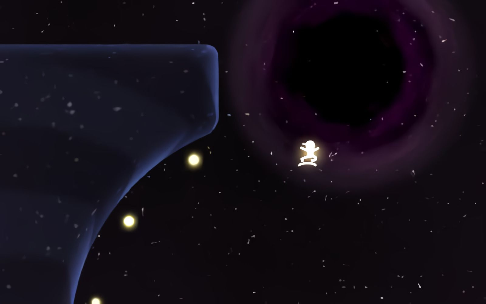

# **Galaxy_Rider** 

---

 

## **Description 📃**
- Ride sick lines though the galactic bowl system adding to your star collection along the way. 
- Try to finish each course as fast as you can!

## **How to play? 🕹️**
- Controls:
	- Click to start
	- `Left`/`Right` -> Move
	- `Up` -> Ollie
	- `Down` -> Pump (Become heavy)
	- `Enter` -> Select Level
	- `R` -> Restart
	- `Esc` -> Menu
	
 

## **Screenshots 📸**

 

 

## Working Video 📹 

https://github.com/kunjgit/GameZone/assets/92252895/a3555fb9-d07d-41fd-8d1e-a167964671c8

 <i>( The video can lag, because it was shooted in low end pc, sorry for the inconvenience )</i>

