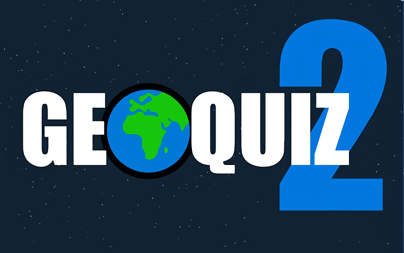

# **Geoquiz_2** 

---

 

## **Description 📃**
- Adjust your browser's zoom and get prepared for a big journey!
- GeoQuiz will get you through 13 levels of increasing difficulty and varying challenges (countries, capitols, famous places, ...).
- Sometimes, the fronteers disappear and the maps get reversed!

## **How to play? 🕹️**
- In each level, you have an error gauge of 30,000km and you have to find 10 different places. 
- When the name of a place appears, click on the map where you think it is placed before the end of the allowed time (10 seconds).
- If you make an error, your error gauge decreases according to your offset.
- If you don't answer in the allowed time, you get a 10,000km penalty.
- When you finish a level, the remaining km are added to your total score.
- If your error gauge gets to zero in a level, the game is over.

 

## **Screenshots 📸**

 

 
