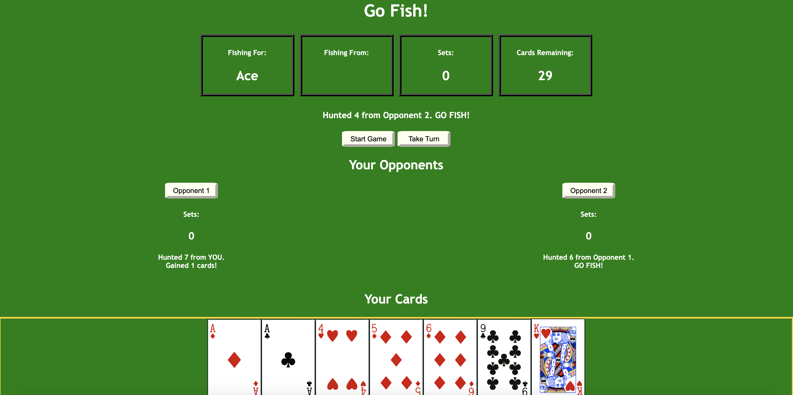

# Go Fish
---------

An emulator for the card game 'Go Fish'. Choose how many opponents you want to play against and see who is better!

## Rules:

- Each player starts with 7 cards (2/3 players) or 5 cards (4 or more players).
- Play begins with you, then each of your opponents from left to right.
- During their turn, each player 'goes fishing' by selecting a value of a card in their hand and another player, in the game this is done by clicking a card and an opponent, then clicking 'Take Turn'. If the selected player has any cards of that value the 'fisher' has made a 'catch'. The selected player must give the 'fisher' all their cards of that value. If the selected player has no cards of that value, the selector has not made a 'catch' and must 'Go Fish!' and draws a new card from the deck.
- If, during their turn, a player ends up with all 4 cards then they have collected a full set. The player then must immediately declare this and play their set face up, in front of them.
- If during play a player ends up with no cards in their hand they must draw a card from the deck, rather than 'going fishing' for cards from other people.
- The winner is the player with the most sets at the end.
- Once all 13 sets have been completed, play ends.

## Tools
- **HTML**
- **CSS**
- **JavaScript**
- **JQuery**
- **Atom Development Environment**
- **SourceTree Source Control**

## Screenshot
