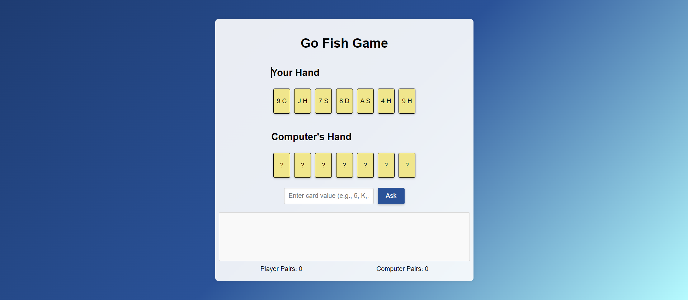

# Go Fish Game

## Description 📃
Go Fish is a classic card game where the objective is to collect as many pairs of cards as possible. Players take turns asking each other for specific cards to match the ones they already have in their hand. The game continues until all pairs have been collected or the deck is empty. The player with the most pairs at the end wins!

## Functionalities 🎮
- Creation of a deck of cards (52 cards).
- Shuffling of the deck before dealing cards.
- Dealing 7 cards to each player at the beginning of the game.
- Implementing the rules of the game (asking for cards, drawing from the deck, forming pairs).
- Tracking pairs and updating the score.
- AI for the computer player to make decisions.
- Detecting the end of the game (when all pairs are formed or the deck is empty).
- Declaring the winner based on the number of pairs collected.

## How to Play? 🕹️
1. Open the game in your web browser.
2. The game automatically shuffles and deals the cards.
3. Enter the value of the card you want to ask the computer for in the input box and click "Ask".
4. The computer will automatically take its turn after you ask for a card.
5. If the computer does not have the card you asked for, you will need to "Go Fish" and draw a card from the deck.
6. The game ends when all pairs are formed or the deck is exhausted, and the winner is declared based on the number of pairs.

## Screenshots 📸

