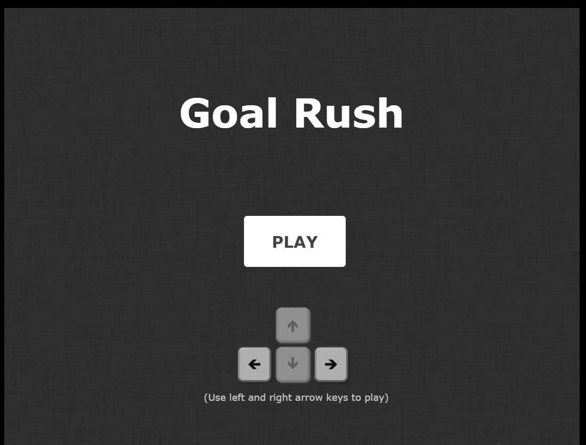
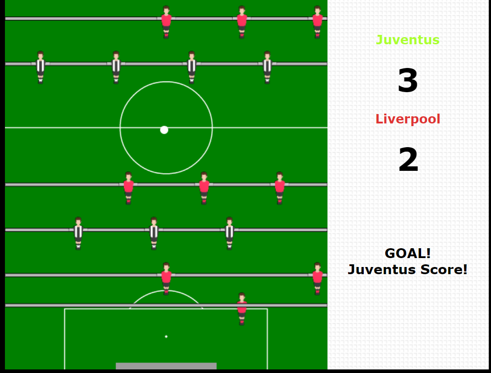
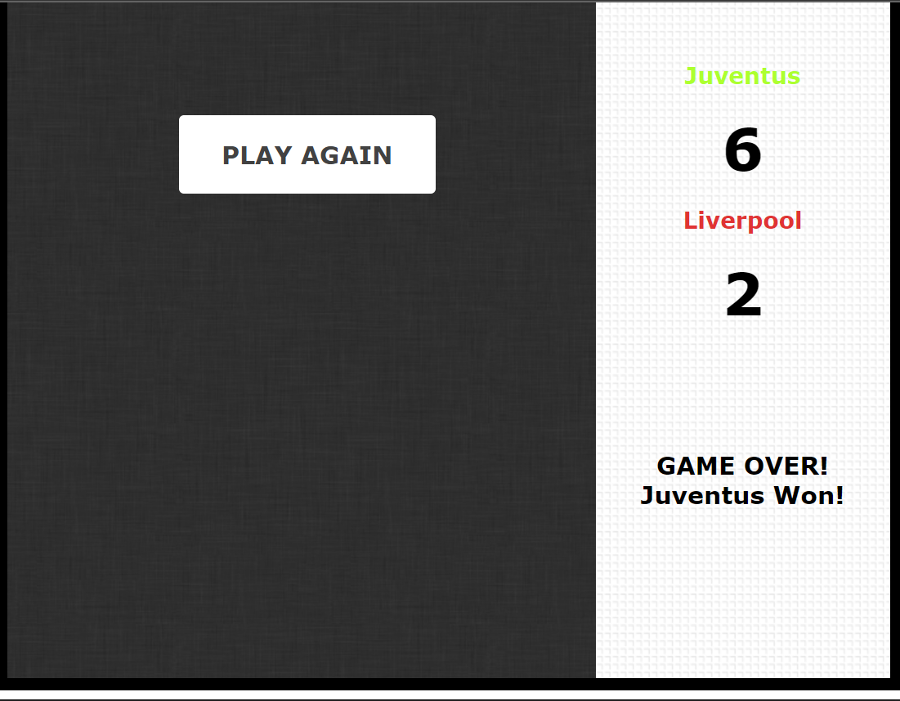

# **Goal Rush** 

---

 
Your Goal!

## **Description 📃**
A web version of Soccer game implemented using html, css and javascript

## **functionalities 🎮**
There is a pitch just like a soccer Field, players of 2 teams and a soccer ball. 

 

## **How to play? 🕹️**
Each player has a goal at one end of the field that they need to defend.
The ball, represented by white ball, moves automatically and can bounce off the walls and players.
The ability to move a player's character horizontally allows them to intercept the ball and try to score goals into the opponent's goal.
the functionality of keys mentioned on the screen.
If a player successfully made a goal, they earn a point.
The game continues for a predetermined duration or until a specific number of goals is reached.
Players can restart the game by refreshing the page.
- 
- 

 

## **Screenshots 📸**

 
 

 

 

 

