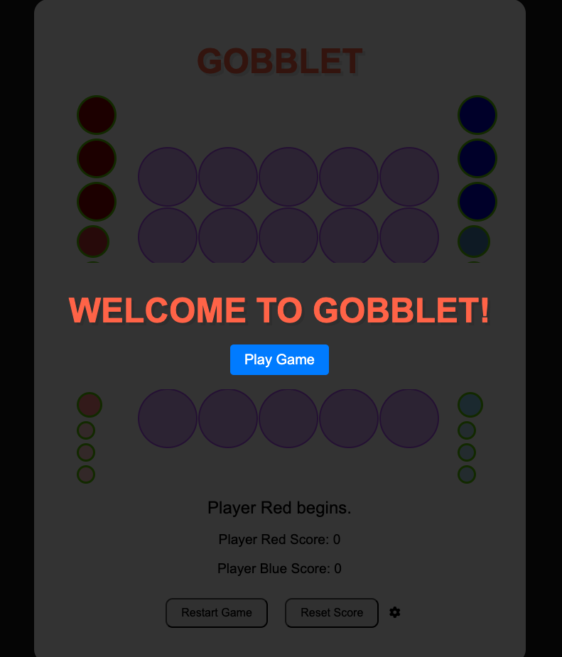
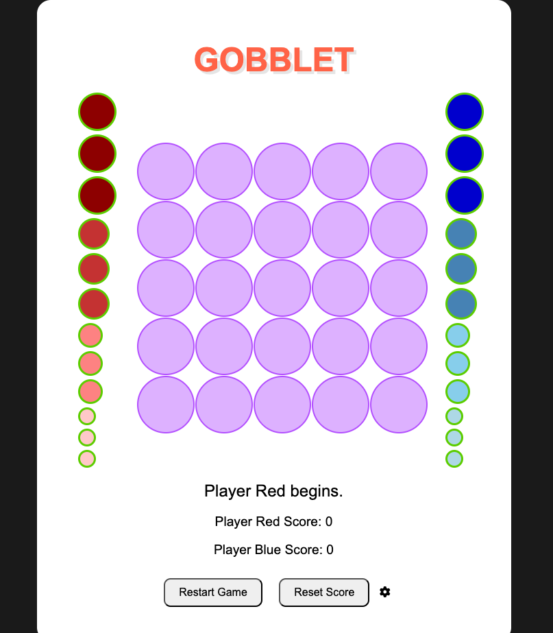
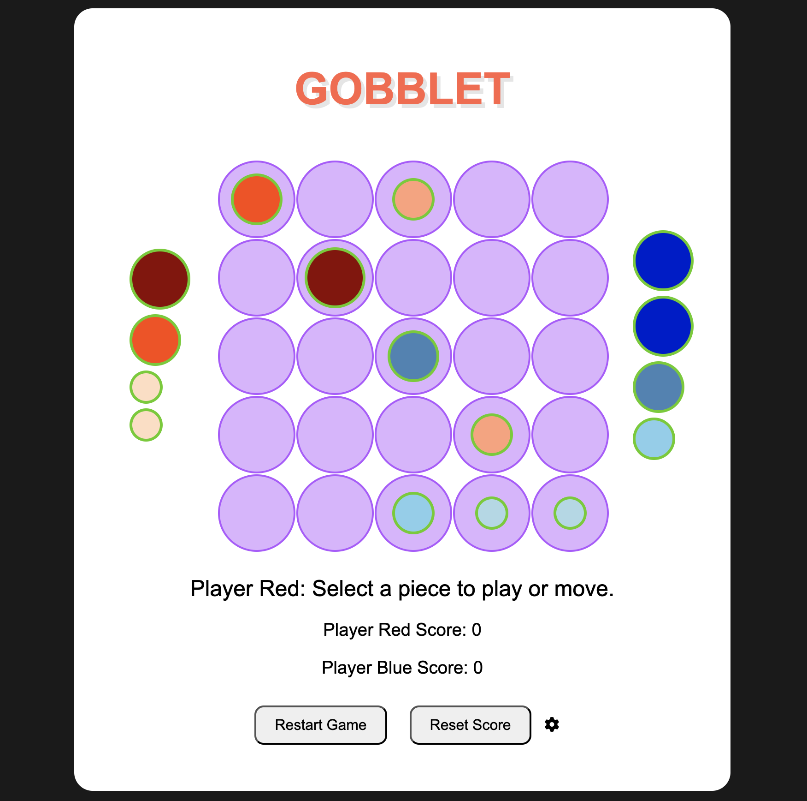
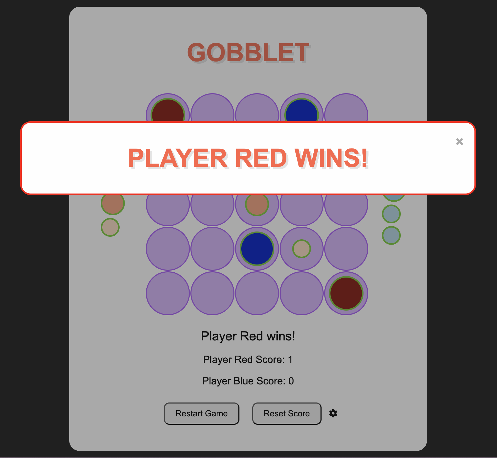
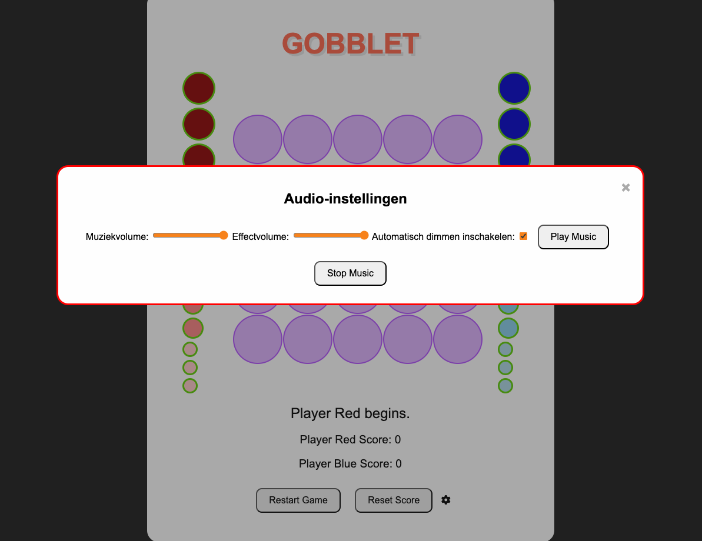

# Gobblet

## Description 📃
Gobblet is a strategic board game where players take 
turns placing their pieces on a 5x5 grid. Each player has 3 pieces 
of each four different sizes (that makes 12 pieces total), and the objective 
is to align five pieces of their color in a row either horizontally, 
vertically, or diagonally. Pieces can be placed on top of smaller pieces, 
and if a larger piece is moved, the smaller piece underneath it becomes 
visible again.

## Functionalities 🎮
- **Piece Placement**: Players can select a piece and place it on the board. Pieces can only be placed on empty cells or on top of smaller pieces.
- **Piece Movement**: Players can move their pieces already on the board to another cell.
- **Stacking**: Pieces can stack on top of each other. If the top piece is moved, the piece underneath becomes visible again.
- **Win Condition**: The game checks for a winning condition when five pieces of the same player align in a row.
- **Score Keeping**: The game keeps track of the score, awarding points for each win.
- **Restart Game**: Players can restart the game while keeping the current score.
- **Reset Score**: Players can reset the scores to zero.

## How to play? 🕹️
1. **Select a Piece**: Click on one of your available pieces to select it.
2. **Place or Move a Piece**: Click on an empty cell or on top of a smaller piece on the board to place the selected piece. You can also move pieces already on the board.
3. **Win the Game**: Align five of your pieces in a row either horizontally, vertically, or diagonally to win the game and score a point.
4. **Restart or Reset**: Use the "Restart Game" button to start a new game or "Reset Score" to reset the scores to zero.

## Screenshots 📸
### Initial Screen

### The Board

### Gameplay

### Winning Condition

### Settings

