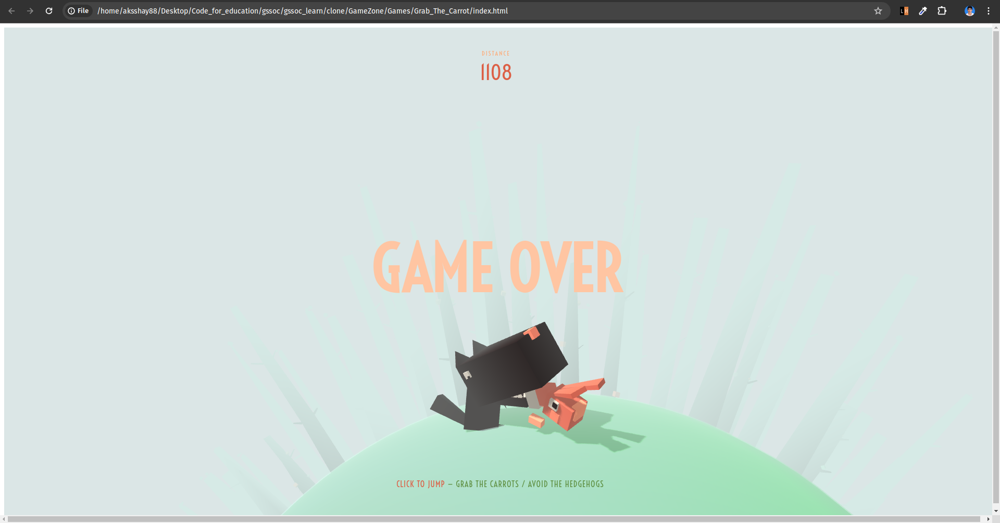

# Grab the Carrot Game

This is a simple 3D game where you control a character to grab carrots while avoiding obstacles.

## Introduction

This game is built using Three.js, a popular JavaScript library for creating 3D graphics in web browsers. It demonstrates basic 3D rendering, animation, and user interaction techniques.

## Features

- Simple and intuitive gameplay
- 3D graphics rendered in the browser
- Responsive design for different screen sizes

## How to Play

1. Use your mouse to click or tap anywhere on the screen to make the character jump.
2. The goal is to grab as many carrots as possible while avoiding obstacles.
3. The game ends if you collide with an obstacle.
4. After the game ends, click or tap to play again.

## **Screenshots 📸**

 

 
