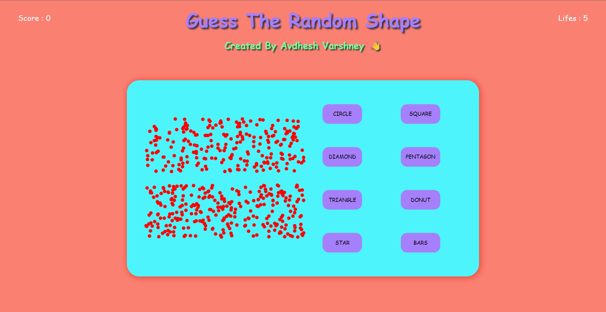

# **GUESS THE RANDOM SHAPE** 

---

 

## **Description 📃** 
- This project is built on a basic web tech stacks such as HTML, CSS and Javascript.
- This is a single-player game.

## **functionalities 🎮** 
- The player will tell the shape formed using dots.
- Options are given in the game.
- If player reaches to 10 points will win the game.
- If player looses all the 5 lifes will lose the game.

## ** Additional Features **
- Displaying the current score of the player.
- Implementing a graphical user interface (GUI) for a more interactive experience.
- Adding a background music so that user will not bored from the game as this game is for minded people.

 

## **Screenshots 📸**

 

 

## **Working video 📹**
<!-- add your working video over here -->
https://github.com/kunjgit/GameZone/assets/114330097/b5e2d3b8-7700-4dee-ad59-6d23d89c19c0

 

## **Creator**
[Avdhesh Varshney](https://github.com/Avdhesh-Varshney)

