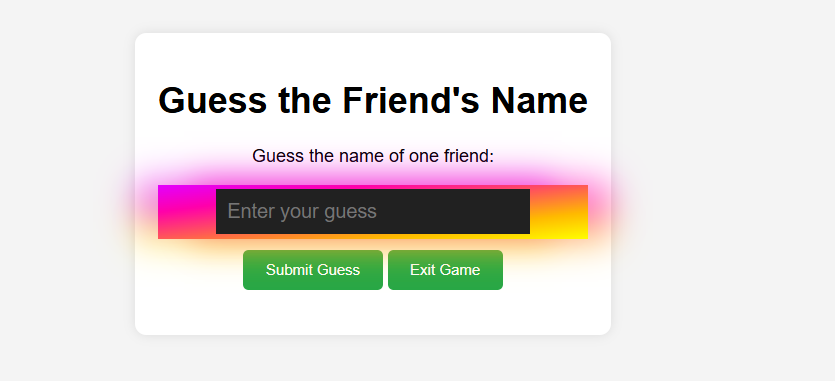

# **Guess_the_friends_name**

---

 

## **Description 📃** 
- Gameplay Overview: In “Guess the Friend's Name” players embark on a journey of memory and luck. player enters the names of four close friends into the game. The game then generates a random name from the list, and the player must use their intuition and knowledge about their friends to guess which name has been chosen.

## **functionalities 🎮** 
- random name generation
- fully responsive design
- user friendly
- assessment availability
 

## **How to play? 🕹️**

How to Play:

-Enter Names: Start by typing in the names of four friends you know well.

-Make Your Guess: Your task is to select the name you believe the game randomly chose.

-Reveal & Score: After making your selection,If your guess was right, you score points; if not, better luck next time!

 

## **Screenshots 📸**

 

 

## **Working video 📹**