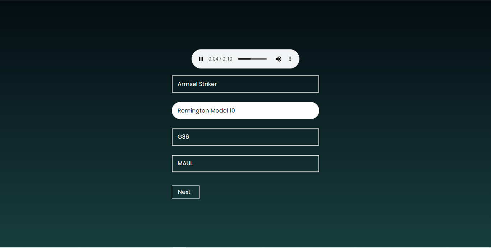

# **Gun From Sound**

---

 

## **Description 📃**

It is a weapon Guessing Game. By this you can came to about lots of new weapon from WWII,PUBG,COD etc.

-

## **functionalities 🎮**

You will get three weapons to guess. You have to guess the weapon by hearing the firing sound of the weapon. You will get 3 chances to guess the weapon. If you guess the weapon correctly you will get 3 points. If you guess the weapon incorrectly you will lose 1 points. If you guess the weapon correctly in the first chance you will get 3 points. If you guess the weapon correctly in the second chance you will get 2 points. If you guess the weapon correctly in the third chance you will get 1 points. If you guess the weapon incorrectly in the first chance you will lose 1 points. If you guess the weapon incorrectly in the second chance you will lose 1 points. If you guess the weapon incorrectly in the third chance you will lose 1 point and get 0 point.
 

## **How to play? 🕹️**

First click the start button. Then you will get three weapons to guess and three chance to guess each of them. Again for each wrong ans you will lose one point. If you give wrong answer each time you will get point zero and move to the next question. After ending you can see your score. You can also play again by clicking the play again button.

-

 

## **Screenshots 📸**

 

 

## **Working video 📹**

<!-- add your working video over here -->

 

## **Creator**
[Saikat Samanta](https://github.com/psykatsamanta)
