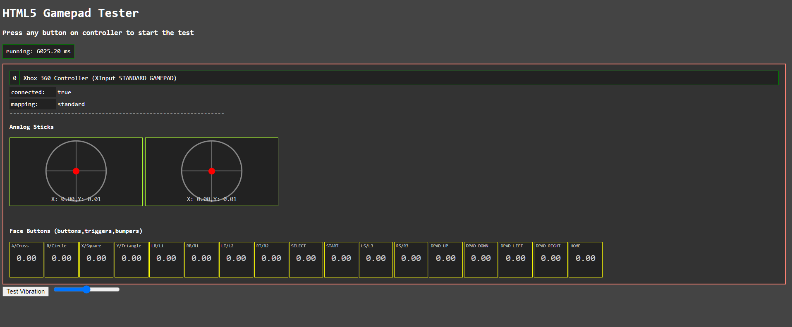

# HTML%_Controller_Tester** 

---

 

## **Description 📃**

- Use to test controller buttons.
- Can be used for Sony Playstation , Microsoft Xbox.
- It is not a game , but a utility for fellow gamers !

## **functionalities 🎮**
- Supports wide range of controllers.
- Vibration functionality can be also checked. 
- Analog Trigger can be also checked, also their pressure strength.
 

## **How to play? 🕹️**

- Just connect your controller as usual
- Open the website
- click any button on controller

 

## **Screenshots 📸**

 
<!-- add your screenshots like this -->
<!--  -->

 

## **Working video 📹**
<!-- add your working video over here -->
