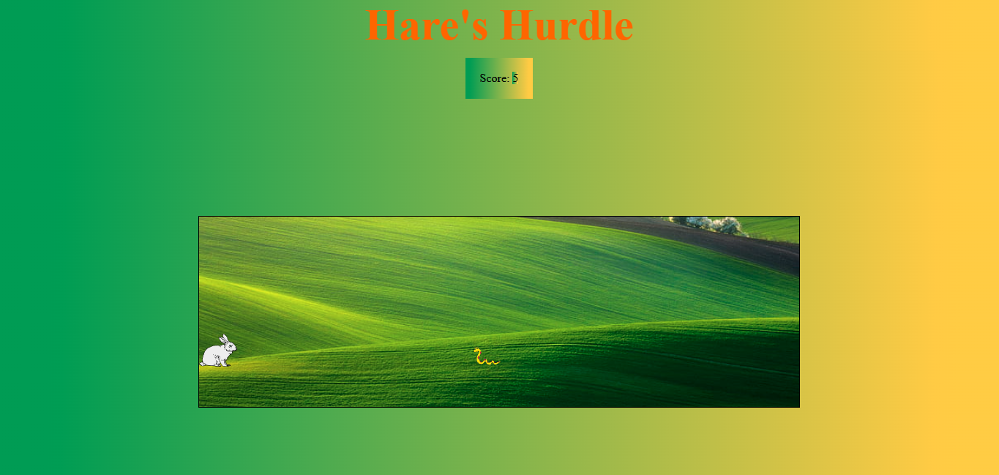

# **Game_Name** 
Hare's Hurdle
---

 

## **Description 📃**
<!-- add your game description here  -->
In this exciting and challenging game, you control a courageous rabbit who must navigate through a perilous environment filled with snakes. The objective is to help the rabbit stay safe by jumping from snake to snake, avoiding their deadly bites. The game tests your reflexes, timing, and strategic thinking as you try to survive for as long as possible.

## **functionalities 🎮**
<!-- add functionalities over here -->
-The game begins as the player clicks to play the game. 
-The player needs to save the rabbit from the snake bite. 
-If the snake touches the rabbit dies and the game is over. 
-It is very easy game which tests your reflexes. 

 

## **How to play? 🕹️**
<!-- add the steps how to play games -->
-Concentrate on the game.  
-According to your reflexes click on the mouse exactly to jump on the snakes. 
-Try clicking at the right time for the rabbit to jump and avoid the snake. 
-Score the highest points and enjoy the game.  

 

## **Screenshots 📸**
 
<!-- add your screenshots like this -->

