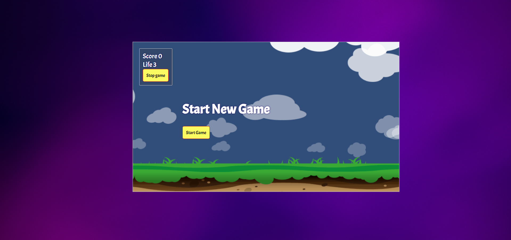

# Helicopter Game

## Description
 This game can be played by single player. It is an interactive game which is made with HTML, CSS, Javascript. This is inspired by both helicopter game, and shooting games.

## Features
- Game Canvas consists of simple background
- A yellow helicopter is the one the player needs to sav efrom crash
- Red helicopters are the ones the player helicopter crashes with
- Collect fuels to increase score. One fuel is equivalent to one point.

## How to play

- Open the game in browser
- Click on start game
- Use arrow keys to navigate the plane
- On top-left corner, you can see the number of lives left and present score.
- Once all lives end, a popup shows your score.
- You can click the stop button to stop the game in the middle.

## Files

- [HTML FILE]('index.html')
- [CSS FILE]('styles.css')
- [GIFS and Images]('assets')

## Screenshots

