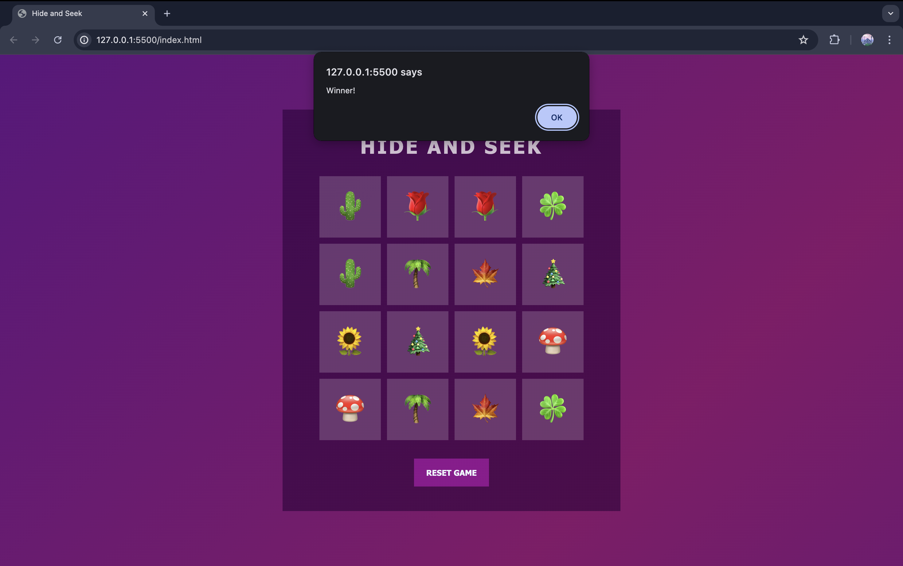

# Hide and Seek

## Description 📌

Hide and Seek is a Memorising flipping-Card Game that features a beautiful and attractive interference where players test their memory skills in order to find out the correct pair of cards. The objective of this game is to test the memory power of player. The player has to flip two cards at a time and find out the matching pair of it, if the player succesfully finds out all the matched pairs, it will be a win otherwise defeat.

## Functionalities 🔎

1. It consists a play area of 4x4 square tiles.
2. Added Gradient effect to make it beautiful.
3. A Reset Button to restart the gameplay.
4. Flipping of tiles to match the pair.
5. A Win! alert, on successfully matching all pairs.

## How to Play 🕹️

- Start by flipping a tile and remember the symbol behind it.
- Here, the game begins now. As you start searching for other tiles and initial tile will hide.
- Now, search for the tile until the pair matches.
- If the pair matches, the tiles will remain open.
- Continuing play in this manner, till all pairs are matched.
- Once all pairs get matched, you'll win the game 🏆.

## Screenshots 📸

Here are some screenshots of the game:

**At the Starting of Game:**

**During Playing:**

**At the End of Game:**

