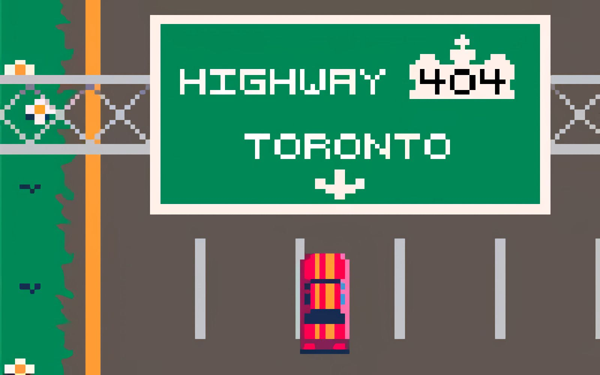

# **Highway_404** 

---

 

## **Description 📃**
- How long will you survive the perils of Highway 404, Canada's evilest motorway? Featuring your favorite HTTP status codes:

## **How to play? 🕹️**

- Status Codes;
	- 103 Early Hints: dispenses in-game instructions
	- 200 Road OK: cancels the adverse effects of 404
	- 301 Road Moved & 302 Temporary Road Redirect: moves you to less dangerous lane
	- 404 Road Not Found: breaks the road behind you
	- 418 I am a Teapot: collects them for extra points
	- 501 Road Not Implemented & 503 Road Unavailable: blocks the road ahead of you
	
- Controls:
	- Desktop: steer with WASD, QZSD or arrow keys
	- Mobile: steer by swiping anywhere on the screen (like it was a virtual D-pad)

 

## **Screenshots 📸**

 

 
