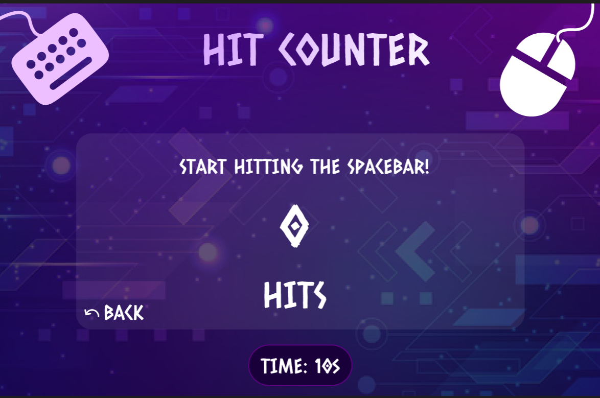

# **Hit_Counter**

---

 

## **Description 📃**

Hit Counter is an interactive web-based game designed to test and measure your speed and accuracy in either hitting the spacebar or clicking the mouse button. Choose your preferred mode and duration, then compete to see how many hits you can achieve within the given time.

## **Functionalities 🎮**

- Set the game duration (in seconds).
- Choose between "Keyboard" mode (spacebar hits) and "Click" mode (mouse clicks).
- Start the game and display a real-time counter and timer.
- Count and animate hits in real-time.
- Display results as hits per minute after the game ends.
- choose new settings and Start again.

 

## **How to Play? 🕹️**

1. **Enter Time**: Input the desired game duration in seconds.
2. **Select Mode**: Choose between "Keyboard" for spacebar hits or "Click" for mouse clicks.
3. **Get Ready**: Click the "Ready" button to start the game.
4. **Start Hitting**:
   - In Keyboard mode, hit the spacebar as quickly as possible.
   - In Click mode, click the mouse button as quickly as possible.
5. **Monitor Time**: Watch the timer and the count of hits update in real-time.
6. **View Results**: After the time runs out, view your hits per minute.
7. **Reset**: Use the Start button to set up a new game.

 

## **Screenshots 📸**

 

<!-- Add your screenshots like this -->

 

## **Working Video 📹**

- [Working Video 📹](https://youtu.be/fZqLdfQNhf8)
