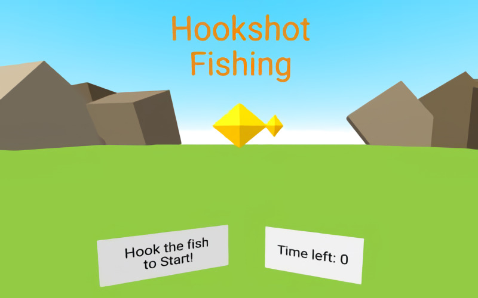

# **Hookshot_Fishing** 

---

 

## **Description 📃**
- Go fishing with your trusty hookshots! 
- There are several fish floating around, and you have a limited amount of time to catch as many as you can.

## **How to play? 🕹️**
- Controls:
	- Requires 6DoF controllers. Tested with an Oculus Rift + Touch controllers.
	- Press any button to shoot your hookshots, then press again to pull them back.
	- Collect fish by catching them with a hookshot and pulling them back towards you.

- Points:
	- Yellow fish = 10 points
	- Purple fish = 50 points

 

## **Screenshots 📸**

 

 
