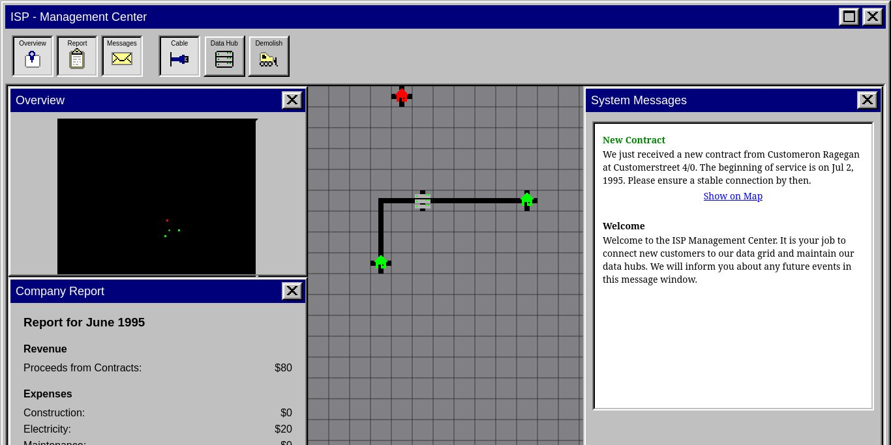

# **ISP** 

---

 

## **Description 📃**
- Manage a 1990s Internet Service Provider. Connect new customers, repair defective data hubs and always keep an eye on your budget.

## **How to play? 🕹️**
- Connect the houses with the data hubs by building new cable connections.
- Data hubs can only service a limited amount of households and have a limited range. Build additional hubs if the bandwidth is too low or the houses are out of range. Customers with slow or no connection will cancel their contract eventually. You will be fined for every lost customer.
- Click on the map to build the selected structure. Use arrow-keys/wasd to move the map or select a location on the minimap.
- The game ends when your money runs out.

 

## **Screenshots 📸**

 

 
