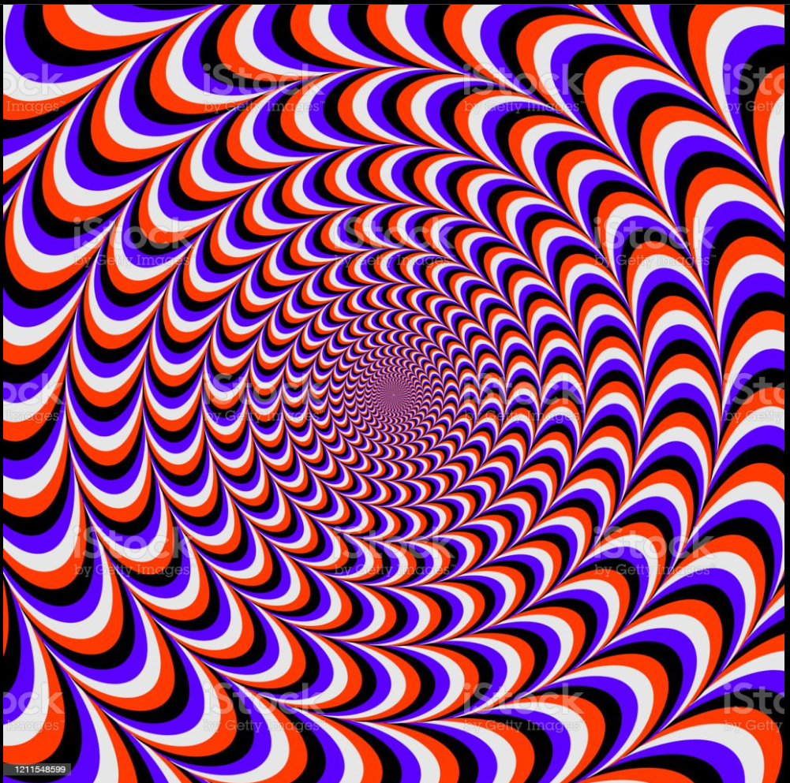

# **Illusion** 

---

 

## **Description 📃**

-  In this game, a rotating illusion pattern is displayed on the screen, and the player has to guess the direction of rotation

## **functionalities 🎮**

- In this simple illusion game, you can allow the user to input their guess for the rotation direction.
 

## **How to play? 🕹️**

- Use the arrow keys or specific keys like "C" for clockwise and "A" for counterclockwise. 

 

## **Screenshots 📸**

 

