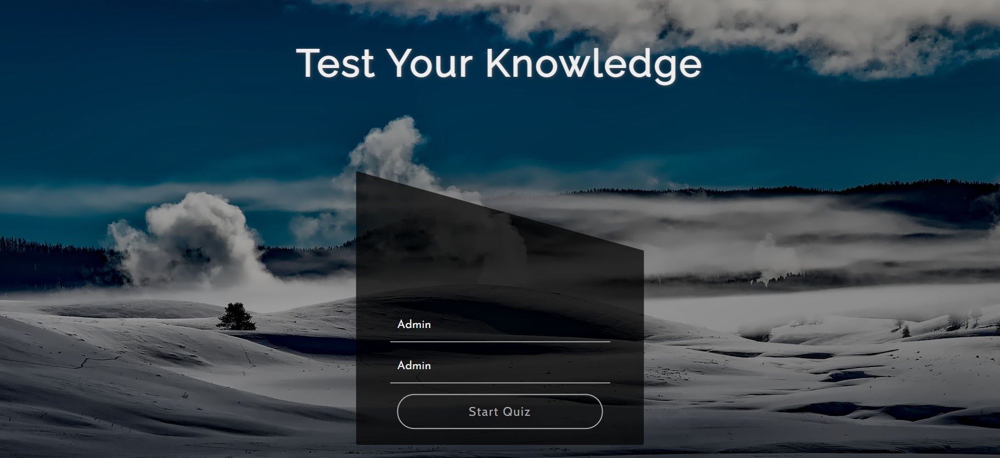
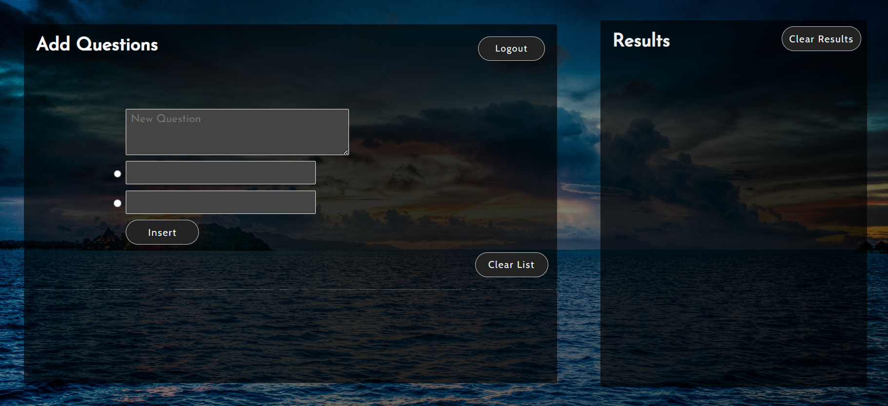
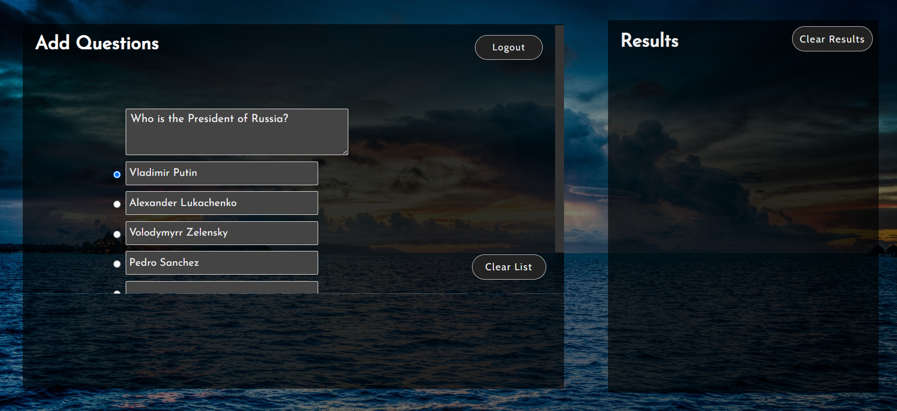
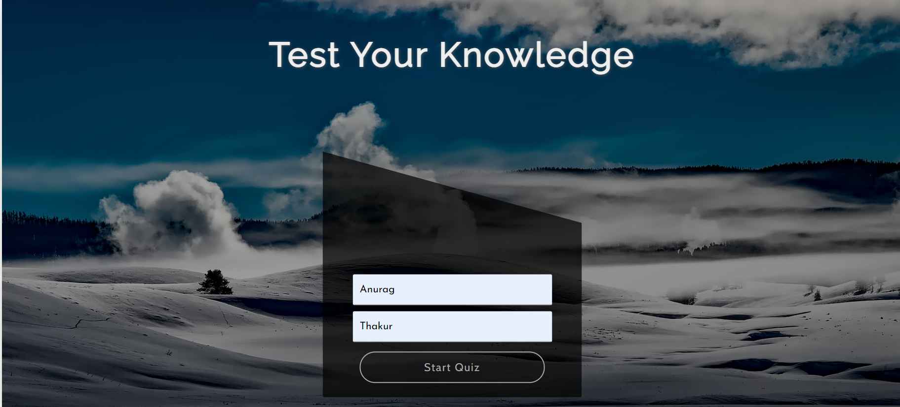
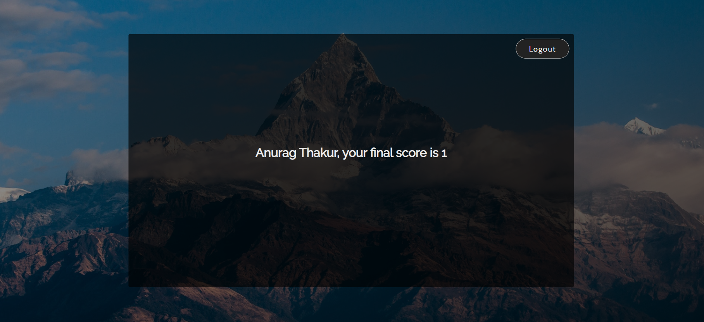

# **Interactive Quizzing Application**

---

 

## **Description 📃** 
- This quizzing application is a user-friendly platform designed to facilitate online quizzes and tests. It provides an intuitive interface for both administrators and participants. The primary features of the application include question management, user management, and quiz administration. Here's a detailed functionalities of the application: ; 

## **functionalities 🎮** 
- **User Management:** 

 The application allows administrators to create and manage user accounts.  
  User roles can be assigned, such as participants or other administrators.
  
- **Question Management:**

 Administrators have full control over the quiz questions.
They can add new questions to the question bank, specifying the question text, options, correct answers, and any additional details.

 The admin can edit existing questions to update the text, options, or correct answers.
Unwanted or outdated questions can be easily deleted from the question bank.
- **Quiz Administration**

 Admins can create quizzes and specify the number of questions.

 The application supports various question formats, such as multiple-choice, true/false.
Quizzes are made available to all participants.

 The admin can set a start and end time for the quiz to control accessibility.
Administrator can view the progress of ongoing quizzes and track participant scores.
 

## **How to play? 🕹️**
- As soon as the page loads, enter **Admin** in First Name and **Admin** as Last Name
-After filling up the details you will be navigated to admin panel where you can add questions.
- Logout from the user panel. Ask your friend to Login as participant by entering First Name and Last Name.
- Attempt the quiz.

 

## **Screenshots 📸**

 

- Admin Screen

- Participant Screen

 

## **Working video 📹**
<!-- add your working video over here -->
Click the following link for project demo video
[Link to Demo](https://drive.google.com/file/d/1os8xHGIFx_KCvcnkWhL4JG4xsX6eE387/view?usp=sharing)

## **Note**
!! After adding the question, Logout as Admin and ask your friend to Login as participant, currently questions are stored in local storage!!
