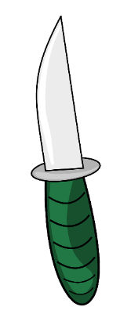

# **Knife-Thrower** 

## **Description 📃**
<!-- add your game description here  -->
Knife-Thrower is an addictive and challenging game where players test their precision and timing by throwing knives onto a spinning board. The goal is to throw knives onto the board without allowing them to collide with each other. With four progressively difficult levels, players will need to sharpen their skills and reflexes to advance through each stage.
 

## **Functionalities 🎮**
<!-- add functionalities over here -->
- Tap on the knife and it will got to the board.
 

## **How to play? 🕹️**
<!-- add the steps how to play games -->
1. The game starts immediately with level 1 in which you will be giving 9 knives.
2. Tap on the knife and it will go to the board.
3. If no knives collide it will go to next level.
4. If two knives collide the game is over an you will go to the first level again.
5. It has 4 levels with increasing difficulties.
6. Challenge yourself to beat the levels!

 

## **Screenshots 📸**

 
<!-- add your screenshots like this -->
<!--  -->

 

