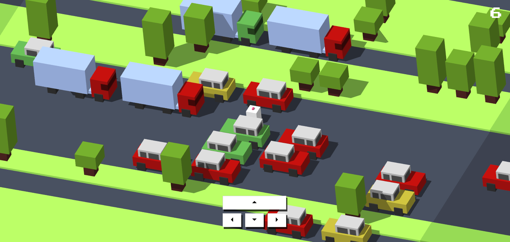

# Lamb Lane

---

## Description 📃

"Lamb Lane" is an exciting game where you control a sheep crossing multiple lanes filled with moving vehicles and obstacles. Your objective is to navigate the sheep safely across the road, avoiding collisions and acquiring more points.

## Functionalities 🎮

- Move the chicken forward, backward, left, or right.
- Dodge cars and trucks as you cross the lanes.
- Encounter forest lanes with trees that require careful navigation.
- Enjoy dynamic lighting effects and realistic vehicle movements.
- Track your progress with a counter displaying the number of successful crossings.
- Retry the game and reset the lanes when the chicken collides with a vehicle.
- Experience smooth animations and responsive controls.
- Immersive gameplay with a 3D environment created using Three.js.
- Enjoy the game on any device with a web browser.

## How to Play? 🕹️

1. Start at one end of the cross lanes.
2. Experience the 3D moving trucks and cars.
3. Dodge them properly to gain more points.
4. If you collide with any vehicle then your game gets stopped.

## Screenshots 📸

## Working Video 📹

<!-- Add a link to a working video of the game -->
