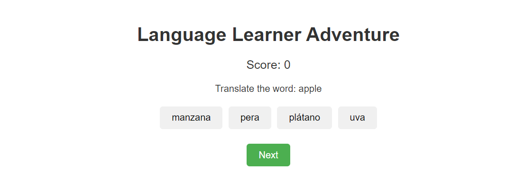

# ** Language Learner Adventure ** 

 

## **Description 📃**

The goal of the game is to help players learn new vocabulary by matching words with their correct translations. Players answer multiple-choice questions and receive feedback on their answers. A scoring system tracks their progress.

## **functionalities 🎮**

- The game displays a word in the target language.
- Players choose the correct translation from multiple options.
- Feedback is given for each answer, indicating whether it was correct or incorrect.
- The score increases with each correct answer.
- The game continues until all questions have been answered.
- The final score is displayed at the end.

 

## **How to play? 🕹️**

- Initialization:
    - Load the first question.
    - Initialize the score to 0.
    - Display the question and answer options.

- Answer Selection:
    - When a player selects an answer, check if it is correct.
    - Update the score if the answer is correct.
    - Provide feedback based on the correctness of the answer.

- Next Question:
    - Move to the next question when the player clicks the "Next" button.
    - If there are no more questions, display the final score and end the game.

- End of Game:
    - Display a message indicating the game is complete.
    - Show the player's final score.

 

## **Screenshots 📸**

 

 
