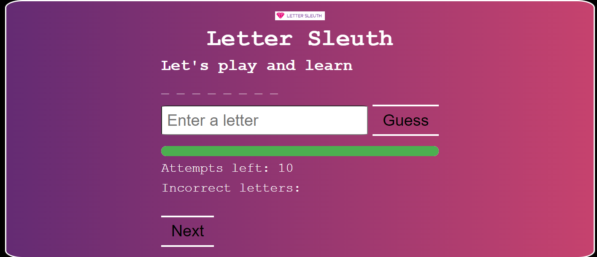

# **Letter_Sleuth**
## Description

* **Word Learning**: Learn new words and their meanings.
* **User Interaction**: Input letters and receive real-time feedback.
* **Progress Tracking**: Track attempts with a progress bar and text.
* **Audio Feedback**: Hear sounds for correct, incorrect, win, and lose.

## Functionalities

* **Letter Guessing**: Players input letters to guess the hidden word.
* **Feedback System**: Real-time feedback on correct and incorrect guesses.
* **Attempt Tracking**: Displays remaining attempts and incorrect letters guessed.
* **Progress Visualization**: Progress bar showing remaining attempts visually.
* **Audio Cues**: Sounds for correct guesses, incorrect guesses, winning, and losing.

## How to play the game?

* Press the "Next" button to begin a new game.
* Enter a single letter into the input field.
* Correct letters appear in the word; incorrect ones reduce attempts.
* Watch the progress bar and attempts left display.
* Guess all letters to win; run out of attempts and lose.

## Screenshots

## Working Video

c:\Users\sweth\Pictures\Camera Roll\Screenshots\LS.mp4<video controls src="LS.mp4" title="Title"></video>