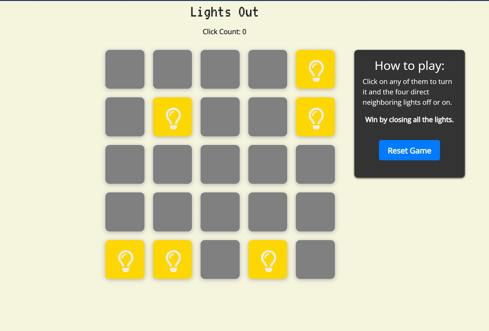

# Lights Out

---

This is a simple implementation of the Lights Out game using HTML, CSS, and JavaScript.

## Description 📃

Lights Out is a puzzle game where the goal is to turn off all the lights on a grid. The grid consists of cells that can be either on or off. When you click on a cell, it toggles the state of that cell as well as its adjacent cells. The objective is to find the correct combination of cell clicks to turn off all the lights on the grid.

## Functionalities 🎮

- The game starts with a grid of lights, where some lights are on and others are off.
- Clicking on a cell toggles the state of that cell and its adjacent cells.
- The game provides feedback on the status of the lights (on or off).
- The game keeps track of the number of moves made.
- The game can be restarted at any time.

## How to Play? 🕹️

1. Start with a grid of lights, where some lights are on and others are off.
2. Click on a cell to toggle the state of that cell and its adjacent cells.
3. The goal is to turn off all the lights on the grid.
4. Keep clicking on cells until all the lights are turned off.
5. The game ends when all the lights are off, and you win.

## Screenshots 📸

## Working Video 📹

<!-- Add a link to a working video of the game -->
