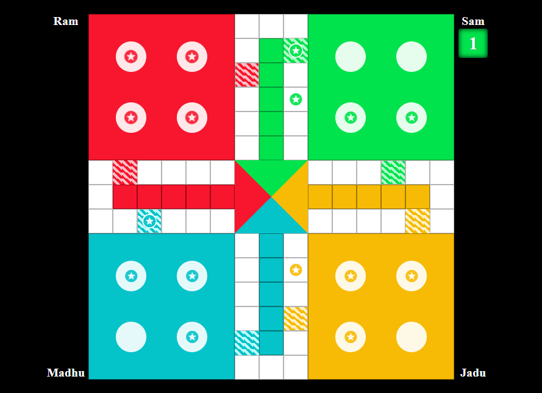

# **Ludo_4_Player** 

---

 

## **Description 📃**
<!-- add your game description here  -->
- Ludo is a simple board game for 2 to 4 players, in which the players race their four tokens from start to finish according to the rolls of a single die. In this game we have 4 colors for 4 players.

## **functionalities 🎮**
<!-- add functionalities over here -->
- Made using HTML,CSS and Javascript.
- Up to 4 players can play the game at the same time.
- It will give an alert if less than 2 person want to play.
- players take turns in a clockwise order
- It will give sounds for every moves which incress the atractiveness of user.
 

## **How to play? 🕹️**
<!-- add the steps how to play games -->
- First of all the players should give their names who ever want to play(maximum 4 players).
- Click the Play button.
- The game is played on a board with four homes, four starting squares, and a central grid.
- Each player has four tokens, which they must move from their starting squares to their home.
- Players take turns rolling a die by clicking the button beside their home and moving their tokens accordingly.
- A player can move their token into an empty space on the board, or they can jump over another player's token if it is in an adjacent space.
- A player's token can be captured if it lands on the same space as another player's token.
- The first player to get all four of their tokens into their home wins the game.

 

## **Screenshots 📸**

 
<!-- add your screenshots like this -->

 

## **Working video 📹**
<!-- add your working video over here -->