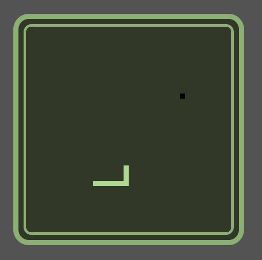

# **Mamba Mayhem** 

---

 

## **Description 📃**
The Snake Game is a classic game where the player maneuvers a line (the snake) which grows in length, with the line itself being a primary obstacle.

 

## **Functionalities 🎮**
- The game uses the arrow keys for navigation.
- The snake grows in length when it consumes the food that randomly appears.
- The game ends when the snake hits the game wall or its own body.

 

## **How to play? 🕹️**
- Use the arrow keys to navigate the snake.
- Try to consume the food that appears randomly.
- Avoid hitting the game wall or the snake's own body.

 

## **Screenshots 📸**
<!-- add your screenshots like this -->

 
