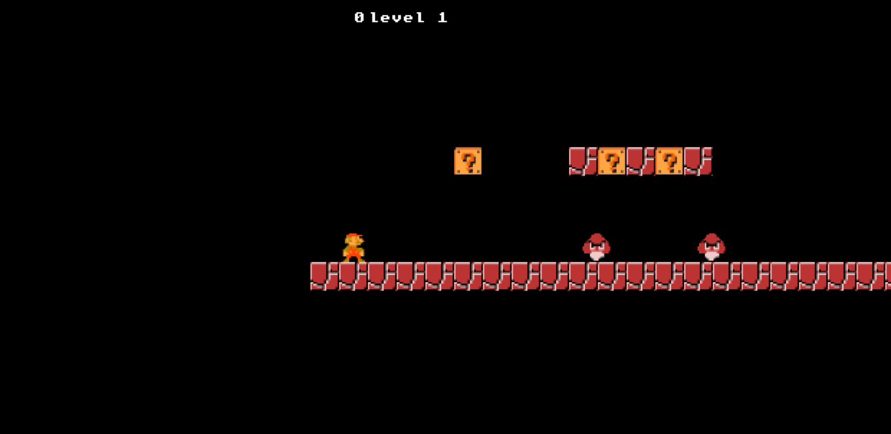

# **Game_Name** 

Mario Game

 

## **Description 📃**
<!-- add your game description here  -->
- The gameplay mechanics of Mario games often involve running, jumping, and occasionally performing special moves like wall jumps or ground pounds. Mario can also interact with the environment by breaking bricks, hitting question blocks, and riding on platforms or vehicles. The levels are designed with precision, offering a mix of platforming challenges, hidden secrets, and boss encounters.

## **functionalities 🎮**
<!-- add functionalities over here -->
- Player Movement: The player can move left and right using the left and right arrow keys, respectively.

- Player Jump: The player can jump by pressing the spacebar. The height of the jump is determined by the JUMP_FORCE constant.

- Level Design: The game includes multiple levels represented by 2D maps. Each level is defined using characters that represent different elements such as platforms, obstacles, enemies, and power-ups.

- Collision Detection: The game checks for collisions between the player and various objects, such as coins, enemies, and pipes. Different actions occur depending on the collision, such as collecting coins, destroying enemies, and transitioning to new levels through pipes.

- Score Tracking: The game keeps track of the player's score. When the player collects a coin, the score increases, and the updated score is displayed on the screen.

- Enemy Movement: Enemies in the game move horizontally from right to left at a constant speed defined by the ENEMY_SPEED constant.

- Power-ups: The game includes power-up items such as mushrooms. When the player collides with a mushroom, they become larger (biggify) for a limited time.

- Surprise Boxes: The game features surprise boxes that contain coins or mushrooms. When the player hits a box from below, the box disappears, and either a coin or a mushroom is spawned.

- Pipe Interaction: The player can interact with pipes. When the player collides with a pipe and presses the down arrow key, they can transition to the next level.

- Game Over: If the player falls below a certain y-position, they lose the game. The "lose" scene is triggered, displaying the final score.

- User Interface: The game displays the current level number and the player's score on the screen.
 

## **How to play? 🕹️**
<!-- add the steps how to play games -->
- Use the left and right arrow keys on your keyboard to move Mario horizontally. Pressing the left arrow key will make Mario move left, while pressing the right arrow key will make him move right.

- Press the spacebar to make Mario jump. The longer you hold down the spacebar, the higher Mario will jump.

- Your goal is to navigate Mario through the level, avoiding enemies and obstacles, and collecting coins to increase your score.

- Mario can interact with different objects in the game. For example, you can make Mario hit the blocks from below to reveal coins or power-ups.

- Be cautious of enemies. If Mario collides with an enemy while not jumping, the game will end. However, if Mario is currently in a jumping state, he can defeat the enemies by jumping on top of them.

- Some levels may contain pipes. When Mario collides with a pipe and you press the down arrow key, you can transition to the next level.

- The game consists of multiple levels, and each level has its own challenges and obstacles. Try to complete each level and achieve the highest score possible.

- If Mario falls below a certain y-position, the game will end, and you will see the "lose" scene with your final score displayed.

 

## **Screenshots 📸**

 
<!-- add your screenshots like this -->

 

## **Working video 📹**
<!-- add your working video over here -->