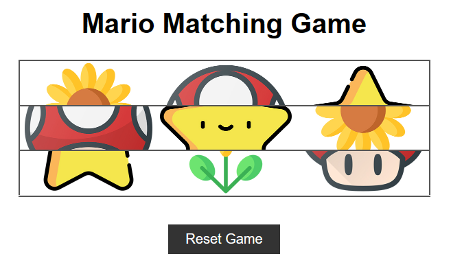

# **Mario_matching_game** 

---

 

## **Description 📃**
<!-- add your game description here  -->
- The game board consists of multiple tiles, each containing an image. This game challenges players to match three identical images.

## **functionalities 🎮**
<!-- add functionalities over here -->
- Made using HTML,CSS and Javascript.
- It is very easy to play.
- Interactive user interface.

 

## **How to play? 🕹️**
<!-- add the steps how to play games -->
- Click on each part and complete the puzzle.
- If players don't get it, simply they can click on Reset Game and try again!

 

## **Screenshots 📸**

 
<!-- add your screenshots like this -->

 

## **Working video 📹**
<!-- add your working video over here -->