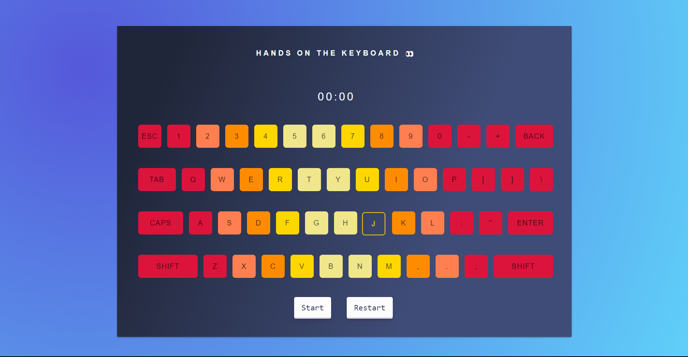

# **Master_Typing**

---

 

## **Description 📃** 
- this game is build to improve your muscle memory by giving random keys to click within 1 min. It is built on basic web tech stacks such as html , css , js and bootstrap

## **functionalities 🎮** 
- random key generation
- fully responsive design
- animated keys 
- assessment availability 
 

## **How to play? 🕹️**
- the game will have animation on one key and you have to press that key
- first press 'Start' button
- now press the animated key
- after ending of 1 min it will provide you the assesment of your capability
- for restrting the game press 'Restart' button
- by practising the keys you will able to improve the muscle memory for you touch typing

 

## **Screenshots 📸**

 

 

## **Working video 📹**
<!-- add your working video over here -->

 [Video](https://i.imgur.com/w56sUaV.mp4)
 <!--after some changes in button functionality-->
 [Video] (https://imgur.com/a/uxx8hlM)
 
