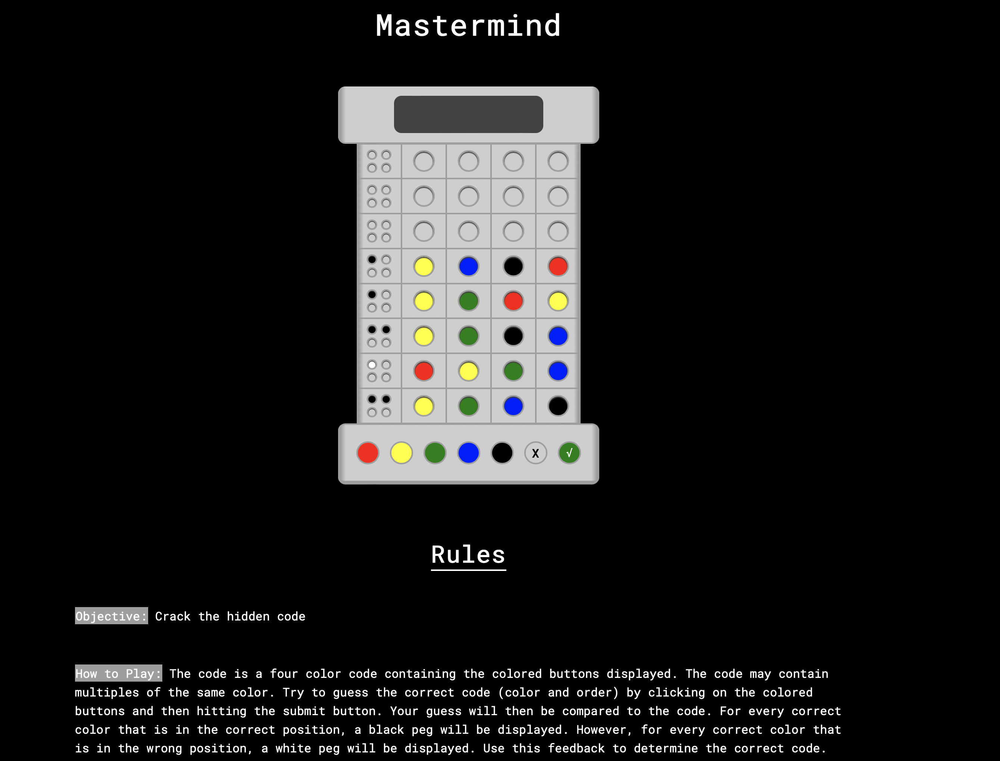

# Mastermind

## Objective: 
Crack the hidden code

## How to Play:

The code is a four color code containing the colored buttons displayed. The code may contain multiples of the same color. Try to guess the correct code (color and order) by clicking on the colored buttons and then hitting the submit button. Your guess will then be compared to the code. For every correct color that is in the correct position, a black peg will  be displayed. However, for every correct color that is in the wrong position, a white peg will be displayed. Use this feedback to determine the correct code.

## **Screenshots 📸**

 

 