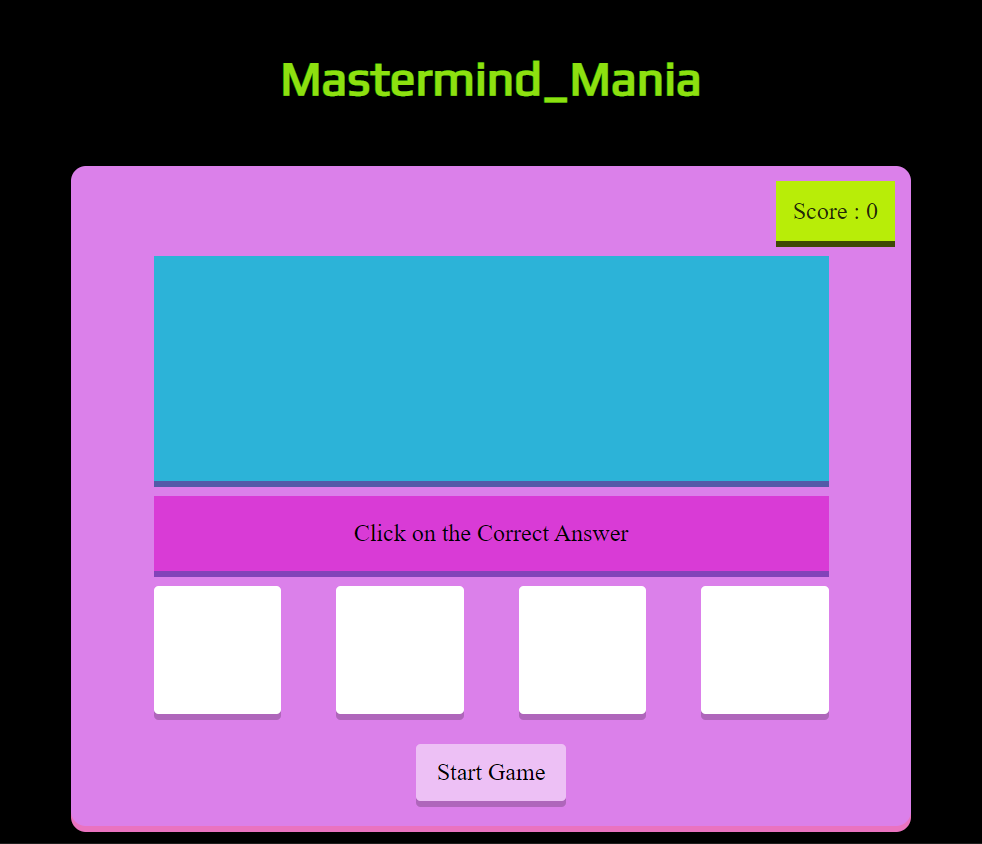
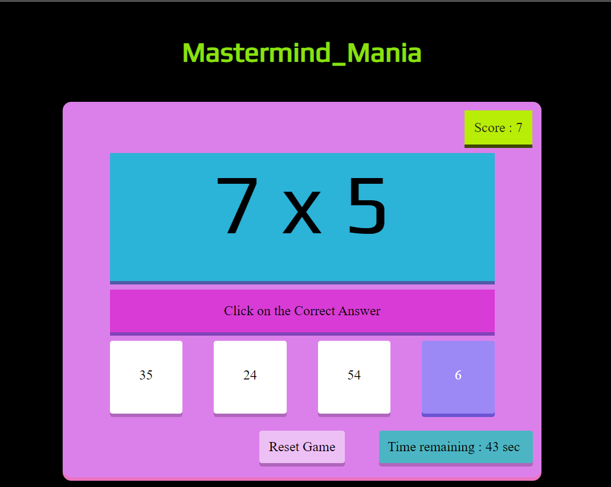

# **Mastermind Mania** 

---

 
Are you a Mastermind?
Let`s Check

## **Description 📃**
Mastermind Mania is a Mathematical calculation game for KIDS, that begins with a sum that must be solved with 4 mcq`s answers. If the answer is correct, you will earn a point and the game continues; otherwise, you lose.

## **functionalities 🎮**
The game is designed using Html, CSS, and javascript.

 

## **How to play? 🕹️**
The calculations will be based on Addition, Subtraction, Multiplication, and Division.
There is a sum on the screen and some options(MCQ`s), solve the sum and choose the correct option.
if the choosen ansswer is correct you will earn a point aor you lose.
- 
- 

 

## **Screenshots 📸**

 
 

 

 

